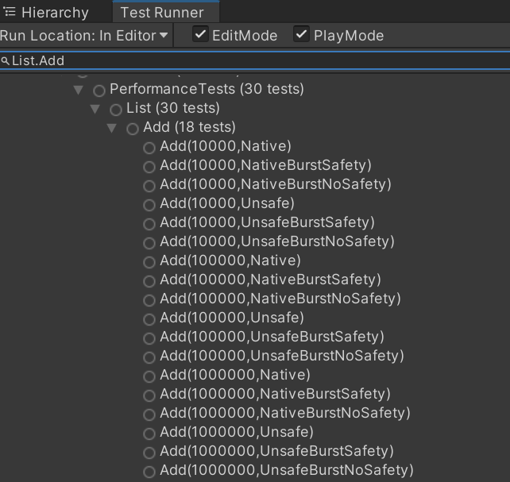
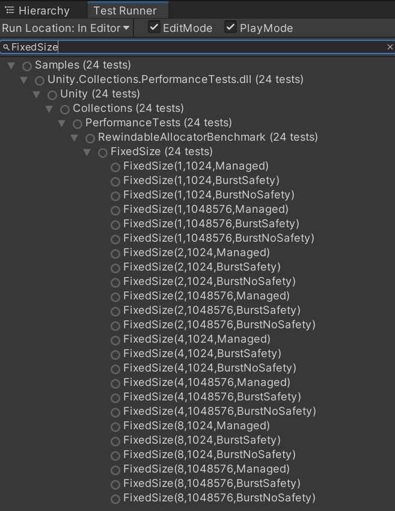

# Collections Benchmarking and Performance Tests

## Table of Contents

- [Overview](#overview)
  - [Containers](#containers)
  - [Allocators](#allocators)
- [Container Benchmarking and Performance Tests](#container-benchmarking-and-performance-tests)
  - [Example Code - List.Add](#example-code---listadd)
  - [Results - List.Add](#results---listadd)
- [Allocator Benchmarking and Performance Tests](#allocator-benchmarking-and-performance-tests)
  - [Example Code - RewindableAllocator.FixedSize](#example-code---rewindableallocatorfixedsize)
  - [Results - RewindableAllocator.FixedSize](#results---rewindableallocatorfixedsize)

## Overview
`com.unity.collections` provides pre-defined intermediate 'glue' layers on top of the Benchmark Framework to enable relatively simple creation of performance and benchmark testing for a wide variety of code paths which may be taken when using the collections package. 

### Containers
Examples of provided benchmarking and performance testing include:
- NativeContainer code
- Burst compiled NativeContainer code with safety enabled
- Burst compiled NativeContainer code with safety disabled
- UnsafeContainer code
- Burst compiled UnsafeContainer code with safety enabled
- Burst compiled UnsafeContainer code with safety disabled

Combine those with:
- Container.ParallelWriter code going wide in any of the above mentioned situations
- Container.ReadOnly code going wide

and it is easy to visualize the vast number of possibilities which we want to monitor and generate concrete performance data *and comparisons* on.

Regarding comparisons, we also want to ensure that these burst compatible containers are competitive or better with a similar container in .NET/IL2CPP/Mono's base class library, and have a way to validate and track improvements there as well, such as those found in:
- System.Collections.Generic
- System.Collections.Concurrent

### Allocators

Naturally, there is a similar story with the custom allocator types provided by the collections package. In this case we want to be able to compare:
- A provided IAllocator implementation in a managed code path
- The same in a Burst compiled code path with safety enabled
- Again the same in a Burst compiled code path with safety disabled

against:
- The UnityEngine built-in Allocator.Temp
- The UnityEngine built-in Allocator.TempJob
- The UnityEngine built-in Allocator.Persistent

---

## Container Benchmarking and Performance Tests

Container performance testing and benchmarks are built around a small handful of types.
|Type|Description|
|---|---|
|`BenchmarkContainerType`|This enum defines variations for Native and Unsafe containers with and without burst compilation - with and without safety enabled. See the inline documentation for full details.|
|`IBenchmarkContainer`|Tests are written as implementations of this interface. It provides means for generic int parameters, allocation and disposal of Native, Unsafe, and C# Base Class Library containers, and measurement of the same.
|`BenchmarkContainerRunner`|Easy-to-use API for running measurements in a single call. See inline documentation for full details, and see below for example usage.|
|`IBenchmarkContainerParallel`|Similar to `IBenchmarkContainer`, but designed to support tightly designed measurement code with Unity Job system workers in mind|
|`BenchmarkContainerRunnerParallel`|Similar to `BenchmarkContainerRunner`, but designed to parameterize worker thread counts for performance testing and benchmarking parallel container implementations|

---

### Example Code - List.Add

Here is a real-world basic example of implementing a performance and test and benchmark comparison for lists. This measures the cost of simply adding elements to a list with the expected capacity pre-allocated.

```
    struct ListAdd : IBenchmarkContainer
    {
        int capacity;
        NativeList<int> nativeContainer;
        UnsafeList<int> unsafeContainer;

        void IBenchmarkContainer.SetParams(int capacity, params int[] args) => this.capacity = capacity;

        public void AllocNativeContainer(int capacity) => ListUtil.AllocInt(ref nativeContainer, capacity, false);
        public void AllocUnsafeContainer(int capacity) => ListUtil.AllocInt(ref unsafeContainer, capacity, false);
        public object AllocBclContainer(int capacity) => ListUtil.AllocBclContainer(capacity, false);

        public void MeasureNativeContainer()
        {
            for (int i = 0; i < capacity; i++)
                nativeContainer.Add(i);
        }
        public void MeasureUnsafeContainer()
        {
            for (int i = 0; i < capacity; i++)
                unsafeContainer.Add(i);
        }
        public void MeasureBclContainer(object container)
        {
            var bclContainer = (System.Collections.Generic.List<int>)container;
            for (int i = 0; i < capacity; i++)
                bclContainer.Add(i);
        }
    }
```
To run these measurements, the calling code is quite simple, and generates a multitude of Performance Test Framework tests which can be run from the Unity Test Runner as well as through CI regression checks, and it also supports the necessary code paths for Benchmarking to make performance comparisons on all the variations *including* the BCL variation. Note the BCL variation of `System.Collections.Generic.List` will not appear as a Performance Test Framework test - it is considered for benchmarking only.
```
    [Benchmark(typeof(BenchmarkContainerType))]
    class List
    {
        ... 
        [Test, Performance]
        [Category("Performance")]
        public unsafe void Add(
            [Values(10000, 100000, 1000000)] int insertions,
            [Values] BenchmarkContainerType type)
        {
            BenchmarkContainerRunner<ListAdd>.Run(insertions, type);
        }
        ...
    }
```

---

### Results - List.Add

This above two code snippets generate something like the following (notice the BCL tests aren't generated):



Running the `DOTS/Unity.Collections/Generate Container Benchmarks` menu item will generate a markdown report, again running the same single code path per type. Here is a snippet of the full results showing only the output for `List.Add`:

> ### *List*
> 
> | Functionality | NativeList (S) | NativeList (S+B) | NativeList (B) | UnsafeList (S) | UnsafeList (S+B) | UnsafeList (B) | *List (BCL)* |
> |---|--:|--:|--:|--:|--:|--:|--:|
> | `Add(10000)` | 0.178ms <span style="color:red">(0.1x)</span>&nbsp;🟠 | 0.057ms  <span style="color:red">(0.3x)</span>&nbsp;&nbsp;&nbsp;&nbsp;&nbsp;&nbsp; | 0.018ms  <span style="color:red">(0.8x)</span>&nbsp;&nbsp;&nbsp;&nbsp;&nbsp;&nbsp; | 0.041ms <span style="color:red">(0.4x)</span>&nbsp;&nbsp;&nbsp;&nbsp;&nbsp;&nbsp; | 0.006ms  <span style="color:green">(2.3x)</span>&nbsp;🟢 | 0.014ms  <span style="color:green">(1.1x)</span>&nbsp;&nbsp;&nbsp;&nbsp;&nbsp;&nbsp; | *0.015ms <span style="color:grey">(1.0x)</span>*&nbsp;&nbsp;&nbsp;&nbsp;&nbsp;&nbsp; |
> | `Add(100000)` | 1.827ms <span style="color:red">(0.1x)</span>&nbsp;🟠 | 0.622ms  <span style="color:red">(0.2x)</span>&nbsp;&nbsp;&nbsp;&nbsp;&nbsp;&nbsp; | 0.180ms  <span style="color:red">(0.8x)</span>&nbsp;&nbsp;&nbsp;&nbsp;&nbsp;&nbsp; | 0.432ms <span style="color:red">(0.3x)</span>&nbsp;&nbsp;&nbsp;&nbsp;&nbsp;&nbsp; | 0.061ms  <span style="color:green">(2.4x)</span>&nbsp;🟢 | 0.139ms  <span style="color:green">(1.1x)</span>&nbsp;&nbsp;&nbsp;&nbsp;&nbsp;&nbsp; | *0.146ms <span style="color:grey">(1.0x)</span>*&nbsp;&nbsp;&nbsp;&nbsp;&nbsp;&nbsp; |
> | `Add(1000000)` | 18.910ms <span style="color:red">(0.1x)</span>&nbsp;🟠 | 6.443ms  <span style="color:red">(0.2x)</span>&nbsp;&nbsp;&nbsp;&nbsp;&nbsp;&nbsp; | 1.814ms  <span style="color:red">(0.8x)</span>&nbsp;&nbsp;&nbsp;&nbsp;&nbsp;&nbsp; | 4.136ms <span style="color:red">(0.4x)</span>&nbsp;&nbsp;&nbsp;&nbsp;&nbsp;&nbsp; | 0.586ms  <span style="color:green">(2.5x)</span>&nbsp;🟢 | 1.482ms  <span style="color:grey">(1.0x)</span>&nbsp;&nbsp;&nbsp;&nbsp;&nbsp;&nbsp; | *1.468ms <span style="color:grey">(1.0x)</span>*&nbsp;&nbsp;&nbsp;&nbsp;&nbsp;&nbsp; |

---

## Allocator Benchmarking and Performance Tests

Allocator performance testing and benchmarks are built around a small handful of types.
|Type|Description|
|---|---|
|`BenchmarkAllocatorType`|This enum defines variations for allocators with and without burst compilation - with and without safety enabled. See the inline documentation for full details.|
|`IBenchmarkAllocator`|Tests are written as implementations of this interface. It provides means for generic int parameters, creation and destruction of allocators, allocation and freeing of memory using these allocators as well as using Unity Engine's built-in allocators `Temp`, `TempJob`, and `Persistent`, and measurement of the same.
|`BenchmarkAllocatorRunner`|Easy-to-use API for running measurements in a single call. See inline documentation for full details, and see below for example usage.|
|`BenchmarkAllocatorUtil`|Generalized API for simplifying common Setup and Teardown implementations of `IBenchmarkAllocator` derived test types|

---

### Example Code - RewindableAllocator.FixedSize

The following example will omit another utility type designed for RewindableAllocator. The type is designed to simplify setup, teardown, and `Rewind` functionality necessary on a per-test-run basis. See [RewindableAllocatorPerformanceTests.cs](RewindableAllocatorPerformanceTests.cs) for reference.

```
    struct Rewindable_FixedSize : IBenchmarkAllocator
    {
        RewindableAllocationInfo allocInfo;

        public void CreateAllocator(Allocator builtinOverride) => allocInfo.CreateAllocator(builtinOverride);
        public void DestroyAllocator() => allocInfo.DestroyAllocator();
        public void Setup(int workers, int size, int allocations) =>
            allocInfo.Setup(workers, size, 0, allocations);
        public void Teardown() => allocInfo.Teardown();
        public void Measure(int workerI) => allocInfo.Allocate(workerI);
    }
```
To run these measurements, the calling code is quite simple, and generates a multitude of Performance Test Framework tests which can be run from the Unity Test Runner as well as through CI regression checks, and it also supports the necessary code paths for Benchmarking to make performance comparisons on all the variations *including* the `Temp`, `TempJob`, and `Persistent` variations. Note these Unity Engine built-in allocator variations will not appear as a Performance Test Framework test - it is considered for benchmarking only.
```
    [Benchmark(typeof(BenchmarkAllocatorType))]
    [BenchmarkNameOverride("RewindableAllocator")]
    class RewindableAllocatorBenchmark
    {
        ...
        [Test, Performance]
        [Category("Performance")]
        [BenchmarkTestFootnote]
        public void FixedSize(
            [Values(1, 2, 4, 8)] int workerThreads,
            [Values(1024, 1024 * 1024)] int allocSize,
            [Values] BenchmarkAllocatorType type)
        {
            BenchmarkAllocatorRunner<Rewindable_FixedSize>.Run(type, allocSize, workerThreads);
        }
        ...
    }
```

---

### Results - RewindableAllocator.FixedSize

This above two code snippets generate something like the following (notice the BCL tests aren't generated):



Running the `DOTS/Unity.Collections/Generate Allocator Benchmarks` menu item will generate a markdown report, again running the same single code path per type. Here is a snippet of the full results showing only the output for `RewindableAllocator.FixedSize`:

> ### *RewindableAllocator*
> 
> | Functionality | RewindableAllocator (S) | RewindableAllocator (S+B) | RewindableAllocator (B) | *TempJob (E)* | *Temp (E)* | *Persistent (E)* |
> |---|--:|--:|--:|--:|--:|--:|
> | `FixedSize(1, 1024)`*³* | 11.4µs  <span style="color:green">(2.5x)</span>&nbsp;&nbsp;&nbsp;&nbsp;&nbsp;&nbsp; | 3.9µs   <span style="color:green">(7.3x)</span>&nbsp;&nbsp;&nbsp;&nbsp;&nbsp;&nbsp; | 3.6µs   <span style="color:green">(7.9x)</span>&nbsp;🟢 | *13.6µs  <span style="color:green">(2.1x)</span>*&nbsp;&nbsp;&nbsp;&nbsp;&nbsp;&nbsp; | *10.2µs   <span style="color:green">(2.8x)</span>*&nbsp;&nbsp;&nbsp;&nbsp;&nbsp;&nbsp; | *28.6µs <span style="color:grey">(1.0x)</span>*&nbsp;🟠 |
> | `FixedSize(2, 1024)`*²˒³* | 27.8µs  <span style="color:green">(2.5x)</span>&nbsp;&nbsp;&nbsp;&nbsp;&nbsp;&nbsp; | 17.7µs   <span style="color:green">(3.9x)</span>&nbsp;&nbsp;&nbsp;&nbsp;&nbsp;&nbsp; | 8.8µs   <span style="color:green">(7.9x)</span>&nbsp;🟢 | *19.3µs  <span style="color:green">(3.6x)</span>*&nbsp;&nbsp;&nbsp;&nbsp;&nbsp;&nbsp; | *10.6µs   <span style="color:green">(6.5x)</span>*&nbsp;&nbsp;&nbsp;&nbsp;&nbsp;&nbsp; | *69.1µs <span style="color:grey">(1.0x)</span>*&nbsp;🟠 |
> | `FixedSize(4, 1024)`*²˒³* | 65.3µs  <span style="color:green">(1.9x)</span>&nbsp;&nbsp;&nbsp;&nbsp;&nbsp;&nbsp; | 73.1µs   <span style="color:green">(1.7x)</span>&nbsp;&nbsp;&nbsp;&nbsp;&nbsp;&nbsp; | 66.8µs   <span style="color:green">(1.8x)</span>&nbsp;&nbsp;&nbsp;&nbsp;&nbsp;&nbsp; | *28.2µs  <span style="color:green">(4.3x)</span>*&nbsp;&nbsp;&nbsp;&nbsp;&nbsp;&nbsp; | *11.8µs  <span style="color:green">(10.3x)</span>*&nbsp;🟢 | *121.8µs <span style="color:grey">(1.0x)</span>*&nbsp;🟠 |
> | `FixedSize(8, 1024)`*²˒³* | 141.5µs  <span style="color:green">(2.1x)</span>&nbsp;&nbsp;&nbsp;&nbsp;&nbsp;&nbsp; | 133.3µs   <span style="color:green">(2.3x)</span>&nbsp;&nbsp;&nbsp;&nbsp;&nbsp;&nbsp; | 158.5µs   <span style="color:green">(1.9x)</span>&nbsp;&nbsp;&nbsp;&nbsp;&nbsp;&nbsp; | *46.0µs  <span style="color:green">(6.6x)</span>*&nbsp;&nbsp;&nbsp;&nbsp;&nbsp;&nbsp; | *11.6µs  <span style="color:green">(26.2x)</span>*&nbsp;🟢 | *303.9µs <span style="color:grey">(1.0x)</span>*&nbsp;🟠 |
> | `FixedSize(1, 1048576)`*³* | 12.3µs <span style="color:green">(16.5x)</span>&nbsp;&nbsp;&nbsp;&nbsp;&nbsp;&nbsp; | 4.6µs  <span style="color:green">(44.2x)</span>&nbsp;&nbsp;&nbsp;&nbsp;&nbsp;&nbsp; | 4.2µs  <span style="color:green">(48.4x)</span>&nbsp;🟢 | *17.3µs <span style="color:green">(11.8x)</span>*&nbsp;&nbsp;&nbsp;&nbsp;&nbsp;&nbsp; | *10.5µs  <span style="color:green">(19.4x)</span>*&nbsp;&nbsp;&nbsp;&nbsp;&nbsp;&nbsp; | *203.3µs <span style="color:grey">(1.0x)</span>*&nbsp;🟠 |
> | `FixedSize(2, 1048576)`*²˒³* | 24.7µs <span style="color:green">(12.1x)</span>&nbsp;&nbsp;&nbsp;&nbsp;&nbsp;&nbsp; | 14.9µs  <span style="color:green">(20.0x)</span>&nbsp;&nbsp;&nbsp;&nbsp;&nbsp;&nbsp; | 10.4µs  <span style="color:green">(28.7x)</span>&nbsp;🟢 | *27.7µs <span style="color:green">(10.8x)</span>*&nbsp;&nbsp;&nbsp;&nbsp;&nbsp;&nbsp; | *11.3µs  <span style="color:green">(26.4x)</span>*&nbsp;&nbsp;&nbsp;&nbsp;&nbsp;&nbsp; | *298.4µs <span style="color:grey">(1.0x)</span>*&nbsp;🟠 |
> | `FixedSize(4, 1048576)`*²˒³* | 70.8µs <span style="color:green">(12.4x)</span>&nbsp;&nbsp;&nbsp;&nbsp;&nbsp;&nbsp; | 77.5µs  <span style="color:green">(11.3x)</span>&nbsp;&nbsp;&nbsp;&nbsp;&nbsp;&nbsp; | 72.5µs  <span style="color:green">(12.1x)</span>&nbsp;&nbsp;&nbsp;&nbsp;&nbsp;&nbsp; | *199.5µs  <span style="color:green">(4.4x)</span>*&nbsp;&nbsp;&nbsp;&nbsp;&nbsp;&nbsp; | *12.5µs  <span style="color:green">(70.2x)</span>*&nbsp;🟢 | *877.7µs <span style="color:grey">(1.0x)</span>*&nbsp;🟠 |
> | `FixedSize(8, 1048576)`*²˒³* | 152.0µs <span style="color:green">(14.5x)</span>&nbsp;&nbsp;&nbsp;&nbsp;&nbsp;&nbsp; | 155.2µs  <span style="color:green">(14.2x)</span>&nbsp;&nbsp;&nbsp;&nbsp;&nbsp;&nbsp; | 160.9µs  <span style="color:green">(13.7x)</span>&nbsp;&nbsp;&nbsp;&nbsp;&nbsp;&nbsp; | *1010.8µs  <span style="color:green">(2.2x)</span>*&nbsp;&nbsp;&nbsp;&nbsp;&nbsp;&nbsp; | *12.4µs <span style="color:green">(177.2x)</span>*&nbsp;🟢 | *2197.7µs <span style="color:grey">(1.0x)</span>*&nbsp;🟠 |
>
> *²* Benchmark run on parallel job workers - results may vary<br/>
> *³* FixedSize(workerThreads, allocSize)<br/>
