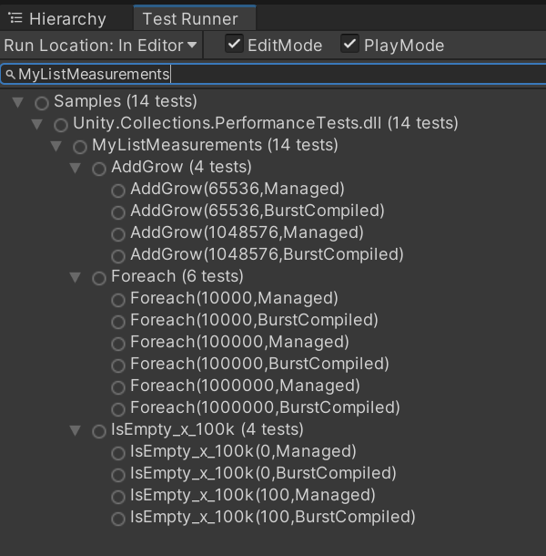

# Benchmark Framework

## Table of Contents

- [Overview and Features](#overview-and-features)
- [Using the Framework](#using-the-framework)
  - [Attribute Summary](#attribute-summary)
- [Example](#example)
  - [Glue Layer - Native Containers](#glue-layer---native-containers)
  - [Performance and Benchmark Tests - Native Containers](#performance-and-benchmark-tests---native-containers)
  - [Results](#results)

## Overview and Features
The Benchmark Framework is a complimentary framework to the Performance Test Framework. It provides a means to write a code for performance tests *one time* for a given type while providing the following benefits:

- Both benchmarks comparisons and performance/regression testing from a single implementation
  - A managed execution path (JIT) from the same single implementation
  - A Burst compiled *with safety* path from the same single implementation
  - A Burst compiled *without safety* path from the same single implementation
- Automatically generate markdown formatted documentation for the Benchmark results
- Provide a simple means for running benchmarks through custom menu items with easily trackable progress and ability to cancel at any time

For the Benchmark Framework itself, tests can be designed to easily group together multiple variations for comparison. For example, the list above may apply to:
- An implementation for Native containers
- Another implementation for Unsafe containers
- And yet another implementation for the container types included in .NET/Mono/IL2CPP Base Class Libraries

Finally, test implementations may be classified such as:
- Only test for benchmarking, but not for performance/regression testing (such as managed BCL containers)
- Consider an implementation variation as the baseline, and compare all other implementation variations against it
- Include only a subset of implementation in case there is a gap in functionality (intentional or not) at this time

<br/>

---
## Using the Framework
To take advantage of the features above and write tests for the Benchmark Framework, three components are required:
1. The Benchmark Framework itself which works alongside the Performance Test Framework
2. An intermediate 'glue' layer for a given benchmark comparison type i.e. BenchmarkContainer, BenchmarkAllocator
3. The Performance Tests themselves, using the intermediate layer from #2 above

Because #1 is provided by the Framework here, the rest of this documentation will give an example of using it to create a 'glue' layer and then a performance test which makes use of this example 'glue' layer.

### Attribute Summary
Most (but not *quite* all) interaction with the Benchmark Framework will occur through its attributes. These are all defined in the `Unity.PerformanceTesting.Benchmark` namespace. A summary will be given here, but further details can be found in the inline code documentation. As mentioned, a small example demonstrating their use will follow.

|Attribute|Description|
|---|---|
|**`[Benchmark]`**|This marks a class containing performance tests to be used in Benchmark Comparison report generation.|
|**`[BenchmarkComparison]`**|This marks an enum as defining the variants that will be generated and simultaneously covers both the Performance Test Framework tests as well as Benchmark Framework tests. *Optionally, this can define the Benchmark baseline if it is also a Performance Test Framework measurement.*|
|**`[BenchmarkComparisonExternal]`**|Used on the same enum definition, this associates non-enum values with the enum for Benchmark Framework tests which *are not* to be included in Performance Test Framework tests. *Optionally, this can define the Benchmark baseline if it is not a Performance Test Framework measurement.*|
|**`[BenchmarkComparisonDisplay]`**|Also used on the same enum definition, this overrides the default measurement sample unit (millisecond, microsecond, etc.), the decimal places for Benchmark report generation, and the ranking statistic for Benchmark report generation (median, minimum, etc.).|
|**`[BenchmarkName]`**|Required with each enum value, this describes a formatting string for naming Benchmark result variations when a report is generated, such as `[BenchmarkName("Native{0}")]`, which when used with a `[Benchmark]` attributed class such as `HashSet`, would generate a the name "NativeHashSet"|
|**`[BenchmarkNameOverride]`**|Override the formatted name in case the class doesn't precisely represent the name that should appear in reports.|
|**`[BenchmarkTestFootnote]`**|Generate a footnote in the Benchmark Comparison report for a given Performance Test method. When used, the footnote will always include a description of the method and its parameters. Optionally, user-defined footnote text may be specified as well.|

Generally, `[Benchmark]`, `[BenchmarkNameOverride]`, and `[BenchmarkTestFootnote]` will be used while writing tests. The rest are used solely in the 'glue' layer, so if you are writing tests on top of a pre-existing 'glue' layer, you will be unlikely to need or use them.

<br/>

---
## Example
### Glue Layer - Native Containers

This will illustrate a simplified version of the com.unity.collections `BenchmarkContainer` implementation as an example of creating an intermediate 'glue' layer between the Benchmark Framework and user-defined performance tests.

1. The first requirement is an `enum` type which defines the test variations that will be benchmarked. Values defined in the enum will also generate Performance Test Framework tests used in regression testing and performance analysis. Values defined through the `[BenchmarkComparison]` attribute will only appear in Benchmark reports.<br/><br/>
You'll notice two attributes used. `[BenchmarkComparison]` denotes this `enum` will be used for benchmarking as well as indicates an externally defined comparison type (BCL) as the baseline to benchmark against, and `[BenchmarkComparisonDisplay]` overrides the default format for report generation and the statistic used for comparison.<br/><br/>
It's worth pointing out that the `{0}` in the name strings will be replaced with the name of the test group, such as `HashSet` or `List`. This also references a `MyExampleConfig` for convenience and consistency which will be defined next.
```
    [BenchmarkComparison(MyExampleConfig.BCL, "{0} (BCL)")]
    [BenchmarkComparisonDisplay(SampleUnit.Millisecond, 3, BenchmarkRankingStatistic.Median)]
    public enum MyExampleType : int
    {
        [BenchmarkName("Native{0}")] Managed,
        [BenchmarkName("Native{0} (B)")] BurstCompiled,
    }
```

2. The configuration class is not a requirement, but rather it is a recommended pattern for storing common data for all tests as well as the interface (in this case a menu item) for running benchmarks and generating the resulting markdown file.<br/><br/>
The main takeaway here is the call to `GenerateMarkdown` which also runs the benchmark tests. Specifically, the argument `typeof(MyExampleType)` refers to the above defined comparison `enum`, and this call will find all the types with a `[Benchmark(typeof(MyExampleType))]` attribute and their methods with the combined `[Test]` and `[Performance]` attributes discover and run benchmark tests. More on this later with the example performance tests which will be benchmarked.
```
    public static class MyExampleConfig
    {
        public const int BCL = -1;

        internal const int kCountWarmup = 5;
        internal const int kCountMeasure = 10;

#if UNITY_EDITOR
        [UnityEditor.MenuItem("Benchmark Example/Generate My Benchmarks")]
#endif
        static void RunBenchmarks() =>
            BenchmarkGenerator.GenerateMarkdown(
                "Containers Example",
                typeof(MyExampleType),
                "Temp/performance-comparison-example.md",
                $"Example benchmark - {kCountMeasure} runs after {kCountWarmup} warmup runs",
                "Legend",
                new string[]
                {
                    "`(B)` = Burst Compiled",
                    "`(BCL)` = Base Class Library implementation (such as provided by Mono or .NET)",
                });
    }
```

3. A `glue` layer should define an `interface` which specifies any test setup, teardown, and measurement for each unique type that will be measured. For the sake of this example, a NativeContainer will be measured, and a managed C# base class library container will be used as a baseline.<br/><br/>
**Notice** there is not a separate interface definition for the NativeContainer's managed code path versus Burst compiled code path. This can be handled automatically by the final piece of the 'glue' layer, defined next.
```
    public interface IMyExampleBenchmark
    {
        public void SetupTeardown(int capacity);
        public object SetupTeardownBCL(int capacity);

        public void Measure();
        public void MeasureBCL(object container);
    }
```

4. Finally, this brings all the individual 'glue' pieces together. Calling this method from a performance framework test implementation (with `[Test]` and `[Performance]` attributes) will ensure the proper code path is executed and measured. Some details worth noting:
   - `BenchmarkMeasure.Measure` handles selecting the code path for either the Performance Test Framework (run through the Test Runner in Unity) or the Benchmark Framework (run through the above defined menu option, for instance).
   - Setup and Teardown calls are *not* timed and measured.
   - Burst compiled (and any other) variants of a single test implementation isn't *entirely* automatic - rather it is defined by the 'glue' layer and specified through the comparison `enum` value.
   - External comparison values such as `MyExampleConfig.BCL` will never be called by the Performance Test Framework. Only the Benchmark Framework will automatically generation measurement invocations with this value.


```
    [BurstCompile(CompileSynchronously = true)]
    public static class MyExampleRunner<T> where T : unmanaged, IMyExampleBenchmark
    {
        [BurstCompile(CompileSynchronously = true)]
        unsafe struct BurstCompiledJob : IJob
        {
            [NativeDisableUnsafePtrRestriction] public T* methods;
            public void Execute() => methods->Measure();
        }

        public static unsafe void Run(int capacity, MyExampleType type)
        {
            var methods = new T();

            switch (type)
            {
                case (MyExampleType)(MyExampleConfig.BCL):
                    object container = null;
                    BenchmarkMeasure.Measure(
                        typeof(T),
                        MyExampleConfig.kCountWarmup, 
                        MyExampleConfig.kCountMeasure,
                        () => methods.MeasureBCL(container),
                        () => container = methods.SetupTeardownBCL(capacity),
                        () => container = methods.SetupTeardownBCL(-1));
                    break;
                case MyExampleType.Managed:
                    BenchmarkMeasure.Measure(
                        typeof(T),
                        MyExampleConfig.kCountWarmup, 
                        MyExampleConfig.kCountMeasure,
                        () => methods.Measure(),
                        () => methods.SetupTeardown(capacity),
                        () => methods.SetupTeardown(-1));
                    break;
                case MyExampleType.BurstCompiled:
                    BenchmarkMeasure.Measure(
                        typeof(T),
                        MyExampleConfig.kCountWarmup, 
                        MyExampleConfig.kCountMeasure,
                        () => new BurstCompiledJob { methods = (T*)UnsafeUtility.AddressOf(ref methods) }.Run(),
                        () => methods.SetupTeardown(capacity), 
                        () => methods.SetupTeardown(-1));
                    break;
            }
        }
    }
```
With these 4 ingredients to the 'glue' layer, writing flexible multipurpose performance and benchmark tests which cover any number of combinations through the minimum amount of code possible - meaning little to no code duplication - is quite easy to do.

There will still be *some* boiler-plate involved, as we do need to adhere to the contract set by the `IMyExampleBenchmark` interface, but the amount of code required to do this for 10s or 100s of performance tests is reduced by about an order of a magnitude compared to doing this manually, and *that* is without consideration even for generating benchmark comparisons and reports.

<br/>

---
## Example
### Performance and Benchmark Tests - Native Containers

Now that we have a 'glue' layer, it should be straightforward to define as many performance and benchmark tests for the comparison types provided by that layer as we can imagine.

1. First let's define a simple utility class to reduce boiler plate in each test. This simply commonizes the setup and teardown, as we can not use inheritance due to needing the implementations to be `unmanaged structs` to satisfy the generic constraint of our `MyExampleRunner` in the 'glue' layer.
```
    static class ListUtil
    {
        static public void SetupTeardown(ref NativeList<int> container, int capacity, bool addValues)
        {
            if (capacity >= 0)
            {
                container = new NativeList<int>(capacity, Allocator.Persistent);
                if (addValues)
                {
                    for (int i = 0; i < capacity; i++)
                        container.Add(i);
                }
            }
            else
                container.Dispose();
        }
        static public object SetupTeardownBCL(int capacity, bool addValues)
        {
            if (capacity < 0)
                return null;
            var list = new System.Collections.Generic.List<int>(capacity);
            if (addValues)
            {
                for (int i = 0; i < capacity; i++)
                    list.Add(i);
            }
            return list;
        }
    }
```

2. Now we'll create an implementation of `IMyExampleBenchmark` provided by the 'glue' layer to grow a list. The code should be straightforward, and each type of container has its code implemented only once. Additionally, the measurement code really is just "the thing we want to measure".
```
    struct ListAddGrow : IMyExampleBenchmark
    {
        int toAdd;
        NativeList<int> nativeContainer;

        public void SetupTeardown(int capacity) 
        {
            toAdd = capacity;
            ListUtil.SetupTeardown(ref nativeContainer, 0, false);
        }
        public object SetupTeardownBCL(int capacity)
        {
            toAdd = capacity;
            return ListUtil.SetupTeardownBCL(0, false);
        }

        public void Measure()
        {
            for (int i = 0; i < toAdd; i++)
                nativeContainer.Add(i);
        }
        public void MeasureBCL(object container)
        {
            var list = (System.Collections.Generic.List<int>)container;
            for (int i = 0; i < toAdd; i++)
                list.Add(i);
        }
    }
```

3. Let's make another implementation of `IMyExampleBenchmark`, this time testing the performance of a `foreach` over the list container types.<br/><br/>
Take special note of the `Volatile.Write` used to ensure optimizations don't throw away the value, thus rendering the loop unnecessary and optimizing it out altogether.
```
    struct ListForEach : IMyExampleBenchmark
    {
        NativeList<int> nativeContainer;

        public void SetupTeardown(int capacity) => ListUtil.SetupTeardown(ref nativeContainer, capacity, true);
        public object SetupTeardownBCL(int capacity) => ListUtil.SetupTeardownBCL(capacity, true);

        public void Measure()
        {
            int value = 0;
            foreach (var element in nativeContainer)
                Volatile.Write(ref value, element);
        }
        public void MeasureBCL(object container)
        {
            int value = 0;
            var list = (System.Collections.Generic.List<int>)container;
            foreach (var element in list)
                Volatile.Write(ref value, element);
        }
    }
```

4. As a final example, we'll implement a performance test for checking if a list container is empty.<br/><br/>
*This time*, neither `Volatile.Read` nor `Volatile.Write` would help much because optimization passes can determine the result of checking for empty is constant through each loop iteration, i.e. there is no dependency within the loop itself when making this calculation. Due to this, we must turn off optimizations altogether with `[MethodImpl(MethodImplOptions.NoOptimization)]`.<br/><br/>
The best that could happen otherwise would be with a `Volatile.Write`. Then, the optimizer would extract the `IsEmpty` or `Count` to outside the loop, calling these only once, and then assign this pre-calculated value to the output of `Volatile.Write` `kIterations` times within a loop. Naturally, this doesn't tell us much about the code we want to measure.
```
    struct ListIsEmpty100k : IMyExampleBenchmark
    {
        const int kIterations = 100_000;
        NativeList<int> nativeContainer;

        public void SetupTeardown(int capacity) => ListUtil.SetupTeardown(ref nativeContainer, capacity, true);
        public object SetupTeardownBCL(int capacity) => ListUtil.SetupTeardownBCL(capacity, true);

        [MethodImpl(MethodImplOptions.NoOptimization)]
        public void Measure()
        {
            for (int i = 0; i < kIterations; i++)
                _ = nativeContainer.IsEmpty;
        }
        [MethodImpl(MethodImplOptions.NoOptimization)]
        public void MeasureBCL(object container)
        {
            var list = (System.Collections.Generic.List<int>)container;
            for (int i = 0; i < kIterations; i++)
                _ = list.Count == 0;
        }
    }
```

5. Now, take our measurement code, and simply pass the `IMyExampleBenchmark` implementations into the `MyExampleRunner<T>` runner provided by the 'glue' layer. See the next section for the results of this work.<br/><br/>
Note `[BenchmarkNameOverride]` is used so that name formatting will look like "NativeList" rather than "NativeMyListMeasurements" in benchmark reports.<br/><br/>
That may have seemed like a lot of code to get to this point, but keep in mind in that once a 'glue' layer exists, it can be used for as many cases as fit. `com.unity.collections` has many, many performance and benchmarks tests built around a single (albeit  more involved) intermediate 'glue' layer.
```
    [Benchmark(typeof(MyExampleType))]
    [BenchmarkNameOverride("List")]
    class MyListMeasurements
    {
        [Test, Performance]
        [Category("Performance")]
        public unsafe void IsEmpty_x_100k(
            [Values(0, 100)] int capacity,
            [Values] MyExampleType type)
        {
            MyExampleRunner<ListIsEmpty100k>.Run(capacity, type);
        }

        [Test, Performance]
        [Category("Performance")]
        [BenchmarkTestFootnote("Incrementally reaching size of `growTo`")]
        public unsafe void AddGrow(
            [Values(65536, 1024 * 1024)] int growTo,
            [Values] MyExampleType type)
        {
            MyExampleRunner<ListAddGrow>.Run(growTo, type);
        }

        [Test, Performance]
        [Category("Performance")]
        public unsafe void Foreach(
            [Values(10000, 100000, 1000000)] int insertions,
            [Values] MyExampleType type)
        {
            MyExampleRunner<ListForEach>.Run(insertions, type);
        }
    }
```

<br/>

---
## Example
### Results

There are two clear results of the List performance tests implemented above
1. The Test Runner in the Unity Editor will display the following Performance Test Framework tests. Note that with one implementation per type, there is both a burst compiled path and non-burst compiled path being measured. One could easily add others (such as burst compiled while safety on or off, or an UnsafeContainer variation of the same tests, though this would require a bit more 'glue' to integrate). Here is an example of the output:



2. Running the `Benchmark Example/Generate My Benchmarks` menu item implemented above will generate a markdown report, again running the same single code path per type. Here is the output:

> # Performance Comparison: Containers Example
> 
> > **<span style="color:red">This file is auto-generated</span>**
> > 
> > All measurments were taken on 12th Gen Intel(R) Core(TM) i9-12900K with 24 logical cores.<br/>
> > To regenerate this file locally use: **DOTS -> Unity.Collections -> Generate &ast;&ast;&ast;** menu.<br/>
> 
> ## Table of Contents
> 
> - [Benchmark Results](#Benchmark%20Results)
>   - [List](#List)
> 
> ## Benchmark Results
> 
> Example benchmark - 10 runs after 5 warmup runs<br/>
> <br/>
> 
> > **Legend**
> > 
> > `(B)` = Burst Compiled<br/>
> > `(BCL)` = Base Class Library implementation (such as provided by Mono or .NET)<br/>
> 
> <br/>
> 
> ### *List*
> 
> | Functionality | NativeList | NativeList (B) | *List (BCL)* |
> |---|--:|--:|--:|
> | `IsEmpty_x_100k(0)`*¹* | 0.373ms <span style="color:red">(0.3x)</span>&nbsp;🟠 | 0.089ms <span style="color:green">(1.1x)</span>&nbsp;🟢 | *0.098ms <span style="color:grey">(1.0x)</span>*&nbsp;&nbsp;&nbsp;&nbsp;&nbsp;&nbsp; |
> | `IsEmpty_x_100k(100)`*¹* | 0.334ms <span style="color:red">(0.3x)</span>&nbsp;🟠 | 0.089ms <span style="color:green">(1.1x)</span>&nbsp;🟢 | *0.098ms <span style="color:grey">(1.0x)</span>*&nbsp;&nbsp;&nbsp;&nbsp;&nbsp;&nbsp; |
> | `AddGrow(65536)`*³* | 1.281ms <span style="color:red">(0.1x)</span>&nbsp;🟠 | 0.427ms <span style="color:red">(0.3x)</span>&nbsp;&nbsp;&nbsp;&nbsp;&nbsp;&nbsp; | *0.144ms <span style="color:grey">(1.0x)</span>*&nbsp;🟢 |
> | `AddGrow(1048576)`*³* | 21.435ms <span style="color:red">(0.1x)</span>&nbsp;🟠 | 7.471ms <span style="color:red">(0.3x)</span>&nbsp;&nbsp;&nbsp;&nbsp;&nbsp;&nbsp; | *2.274ms <span style="color:grey">(1.0x)</span>*&nbsp;🟢 |
> | `Foreach(10000)` | 0.042ms <span style="color:red">(0.4x)</span>&nbsp;🟠 | 0.003ms <span style="color:green">(6.6x)</span>&nbsp;🟢 | *0.018ms <span style="color:grey">(1.0x)</span>*&nbsp;&nbsp;&nbsp;&nbsp;&nbsp;&nbsp; |
> | `Foreach(100000)` | 0.452ms <span style="color:red">(0.4x)</span>&nbsp;🟠 | 0.025ms <span style="color:green">(7.4x)</span>&nbsp;🟢 | *0.184ms <span style="color:grey">(1.0x)</span>*&nbsp;&nbsp;&nbsp;&nbsp;&nbsp;&nbsp; |
> | `Foreach(1000000)` | 4.500ms <span style="color:red">(0.4x)</span>&nbsp;🟠 | 0.250ms <span style="color:green">(7.5x)</span>&nbsp;🟢 | *1.877ms <span style="color:grey">(1.0x)</span>*&nbsp;&nbsp;&nbsp;&nbsp;&nbsp;&nbsp; |
> 
> *¹* Optimizations were disabled to perform this benchmark<br/>
> *³* AddGrow(growTo) -- Incrementally reaching size of `growTo`<br/>
 
*Happy Benchmarking!*