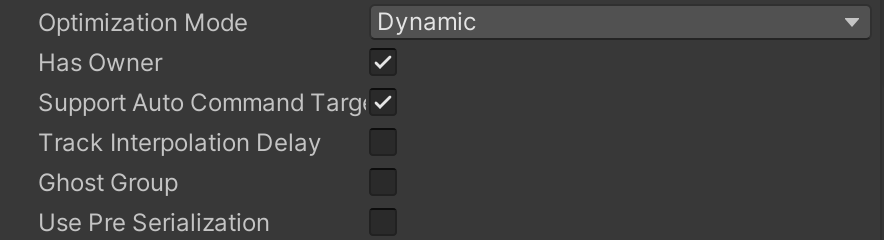

# Command stream

The client continuously sends a command stream to the server when the `NetworkStreamConnection` is tagged to be "in-game". This stream includes all inputs, and acknowledgements of the last received snapshot. 
Thus, the connection will be kept alive, even if the client does not have controlled entities, and does not generate any inputs that need to be transmitted to the server.
The command packet is still sent at a regular interval (every full simulated tick), to automatically acknowledge received snapshots, and to report other important information to the server.

## Creating inputs (i.e. commands)
To create a new input type, create a struct that implements the `ICommandData` interface. To implement that interface you need to provide a property for accessing the `Tick`.

The serialization and registration code for the `ICommandData` will be generated automatically, but it is also possible to disable that and write the serialization [manually](command-stream.md#manual-serialization).

The `ICommandData` buffer can be added to the entity controlled by the player either at baking time (using an authoring component) or at runtime. <br/>In the latter, make sure the dynamic buffer is present on both server and client.

### Handling input on the client
The client is only responsible for polling the input source and add `ICommand` to buffer for the entities who it control. <br/>
The queued commands are then automatically sent at regular interval by `CommandSendPacketSystem`.

The systems responsible for writing to the command buffers must all run inside the [GhostInputSystemGroup](https://docs.unity3d.com/Packages/com.unity.netcode@latest/index.html?subfolder=/api/Unity.NetCode.GhostInputSystemGroup.html).

### ICommandData serialization and payload limit
When using ICommand, the Netcode for Entities package automatically generated the command serialization code for you. </br>
Commands serialization take place in the `CommandSendSystemGroup`. Each individual command is serialized and enqueued into the `OutgoingCommandDataStreamBuffer` (present on the network connection) 
by its own code-generated system. </br> The `CommandSendPacketSystem` is then responsible to flush the outgoing buffer at `SimulationTickRate` interval. 

In order to fight packet losses, along with with last input, we also include as a form of redundancy the last 3 input. 
Each redundant command is delta compressed against the command for the current tick. The final serialized data looks something like:

```
| Tick, Command | CommandDelta(Tick-1, Tick) | CommandDelta(Tick-2, Tick) | CommandDelta(Tick-3, Tick)|
```

**The package enforce a size limit of 1024 bytes** to the command payload. The check is performed when the command is serialise into the outgoing buffer and
an error will be reported to the application if the encoded payload that does not respect the constraint.

### Receiving commands on the server
`ICommandData` are automatically received by the server by the `NetworkStreamReceiveSystem` and added to the `IncomingCommandDataStreamBuffer` buffer. The `CommandReceiveSystem` is then responsible 
to dispatch the command data to the target entity (which the command belong to).

> [!NOTE]
> The server must only receive commands from the clients. It should never overwrite or change the input received by the client.

## Automatic handling of commands. The AutoCommandTarget component.
If you add your `ICommandData` component to a ghost (for which the following options has been enabled in the `GhostAuthoring):
1. `Has Owner` set
2. `Support Auto Command Target` 



the commands for that ghost will **automatically be sent to the server**. The following rules apply:
- the ghost must be owned by your client (requiring the server to set the `GhostOwner` to your `NetworkId.Value`), 
- the ghost is `Predicted` or `OwnerPredicted` (i.e. you cannot use an `ICommandData` to control interpolated ghosts),
- the [AutoCommandTarget](https://docs.unity3d.com/Packages/com.unity.netcode@latest/index.html?subfolder=/api/Unity.NetCode.AutoCommandTarget.html).Enabled flag is set to true.

If you are not using `Auto Command Target`, your game code must set the [CommandTarget](https://docs.unity3d.com/Packages/com.unity.netcode@latest/index.html?subfolder=/api/Unity.NetCode.CommandTarget.html) on the connection entity to reference the entity that the `ICommandData` component has been attached to. 
<br/> You can have multiple `ICommandData` in your game, and Netcode for Entities will only send the `ICommandData` for the entity that `CommandTarget` points to.

When you need to access the inputs from the buffer, you can use an extension method for `DynamicBuffer<ICommandData>` called `GetDataAtTick` which gets the matching tick for a specific frame. You can also use the `AddCommandData` utility method (which adds more commands to the ring-buffer for you).

> [!NOTE]
> When you update the state of your simulation inside the prediction loop, you must rely only on the commands present in the `ICommandData` buffer (for a given input type). 
Polling input directly, by using UnityEngine.Input or other similar method, or relying on input information not present in the struct implementing the `ICommandData` interface may cause client
mis-prediction. </br>

## Checking which ghost entities are owned by the player, on the client.
> [!NOTE]
> It is required you use (and implement) the `GhostOwner` functionality, for commands to work properly. For example: By checking the 'Has Owner' checkbox in the `GhostAuthoringComponent`.

**On the client, it is very common to want to lookup (i.e. query for) entities that are owned by the local player.** 
This is problematic, as multiple ghosts may have the same `CommandBuffer` as your "locally owned" ghost (e.g. when using [Remove Player Prediction](prediction.md#remote-players-prediction), _every other "player" ghost_ will have this buffer),
and your input systems (that populate the input command buffer) may accidentally clobber other players buffers.

There are two ways to handle this properly:

### Use the new `GhostOwnerIsLocal` component (PREFERRED)
All ghosts have a special enableable component, `GhostOwnerIsLocal` that you can now use to filter out ghosts not owned by "you".

For example:
```c#
Entities
    .WithAll<GhostOwnerIsLocal>()
    .ForEach((ref MyComponent myComponent)=>
    {
        // your logic here will be applied only to the entities owned by the local player.    
    }).Run();
```
### Use the GhostOwner
You can filter the entities manually by checking that the `GhostOwner.NetworkId` of the entity equals the `NetworkId` of the player.

```c#
var localPlayerId = GetSingleton<NetworkId>().Value;
Entities
    .ForEach((ref MyComponent myComponent, in GhostOwner owner)=>
    {
        if(owner.NetworkId == localPlayerId)
        {
            // your logic here will be applied only to the entities owned by the local player.
        }                
    }).Run();
```

## Automatic command input setup using IInputComponentData

It's possible to have most of the things mentioned above for command data usage set up automatically for you given an input component data struct you have set up. You need to inherit the `IInputComponentData` interface on the input struct and the task of adding it to the command data buffer and retrieving back from the buffer when processing inputs will be handled automatically via code generated systems. For this to work it is required to have input gathering and input processing (like movement system) set up in two separate systems.

> [!NOTE]
> It is required that you use the `GhostOwner` functionality, for example by checking the `Has Owner` checkbox in the ghost authoring component for this to work.
>
> [!NOTE]
> Per prefab overrides done in the ghost authoring component inspector are disabled for input components and their companion buffer. You can add a ghost component attribute on the input component in code and it will apply to the buffer as well.

Because input struct implementing `IInputComponentData` are baked by `ICommandData`, [the 1024 bytes limit for the payload](ICommandData serialization and payload limit) also apply. 

### Input events

By using the `InputEvent` type within `IInputComponentData` inputs you can guarantee one off events (for example gathered by `UnityEngine.Input.GetKeyDown`) will be synchronized properly with the server and registered exactly once. Even when the exact input tick where the input event was first registered is dropped on its way to the server.

### How it works

Given an input component data you'll have these systems set up.

- Gather input system (Client loop)
  - Take input events and save them in the input component data. This happens in `GhostInputSystemGroup`.
- Process input system (Server or prediction loop)
  - Take current input component and process the values. This _usually_ happens in `PredictedSimulationSystemGroup`.

With `IInputComponentData` netcode handling it looks like this with code generated systems.

- _Gather input system (Client loop)_
  - _Take input events and save them in the input component data. This happens in `GhostInputSystemGroup`._
- Copy input to command buffer (Client loop)
  - Take current input data component and add to command buffer, also recording current tick
- Apply inputs for current tick to input component data (Server or prediction loop)
  - Retrieve inputs from command buffer for current tick and apply to input component. With prediction multiple input values could be applied as prediction rolls back (see [Prediction](prediction.md)).
- _Process input system (Server or prediction loop)_
  - _Take current input component and process the values. This _usually_ happens in `PredictedSimulationSystemGroup`._

The first and last steps are the same as with the single player input handling, and these are the only systems you need to write/manage. An important difference, with netcode enabled input, is that the processing system can be called multiple times per tick as previous ticks (rollback) are handled.

### Example code

Simple input values for character movement (with jumping):

```c#
using Unity.Entities;
using Unity.NetCode;

[GenerateAuthoringComponent]
public struct PlayerInput : IInputComponentData
{
    public int Horizontal;
    public int Vertical;
    public InputEvent Jump;
}
```

Input gathering system, it basically takes current inputs and applies to the input component data on the local players entity.

```c#
[UpdateInGroup(typeof(GhostInputSystemGroup))]
[AlwaysSynchronizeSystem]
public partial class GatherInputs : SystemBase
{
    protected override void OnCreate()
    {
        RequireForUpdate<PlayerInput>();
    }

    protected override void OnUpdate()
    {
        bool jump = UnityEngine.Input.GetKeyDown("space");
        bool left = UnityEngine.Input.GetKey("left");
        //...

        var networkId = GetSingleton<NetworkId>().Value;
        Entities.WithName("GatherInput").WithAll<GhostOwnerIsLocal>().ForEach((ref PlayerInput inputData) =>
            {
                inputData = default;

                if (jump)
                    inputData.Jump.Set();
                if (left)
                    inputData.Horizontal -= 1;
                //...
            }).ScheduleParallel();
    }
}
```

Processing input system, takes current input values stored on the players input component and applies the equivalent movement actions.

```c#
    [UpdateInGroup(typeof(PredictedSimulationSystemGroup))]
    public partial class ProcessInputs : SystemBase
    {
        protected override void OnCreate()
        {
            RequireForUpdate<PlayerInput>();
        }
        protected override void OnUpdate()
        {
            var movementSpeed = Time.DeltaTime * 3;
            Entities.WithAll<Simulate>().WithName("ProcessInputForTick").ForEach(
                (ref PlayerInput input, ref Translation trans, ref PlayerMovement movement) =>
                {
                    if (input.Jump.IsSet)
                        movement.JumpVelocity = 10; // start jump routine

                    // handle jump event logic, movement logic etc
                }).ScheduleParallel();
        }
    }
```

## Manual serialization

In order to implement serialization manually you need to add the `[NetCodeDisableCommandCodeGen]` attribute to the struct implementing the `ICommandData` interface.

You will also need to create a struct implementing `ICommandDataSerializer<T>` - where `<T>` is your `ICommandData` struct.

[ICommandDataSerializer](https://docs.unity3d.com/Packages/com.unity.netcode@latest/index.html?subfolder=/api/Unity.NetCode.ICommandDataSerializer-1.html) has two __Serialize__ and two __Deserialize__ methods: one pair for raw values, and one pair for delta compressed values. The system sends multiple inputs in each command packet. The first packet contains raw data but the rest are compressed using delta compression. Delta compression compresses inputs well because the rate of change is low.

As well as creating a struct you need to create specific instances of the generic systems `CommandSendSystem` and `CommandReceiveSystem`. To do this, extend the base system, for example with
```c#
[UpdateInGroup(typeof(CommandSendSystemGroup))]
[BurstCompile]
public partial struct MyCommandSendCommandSystem : ISystem
{
    CommandSendSystem<MyCommandSerializer, MyCommand> m_CommandSend;
    [BurstCompile]
    struct SendJob : IJobChunk
    {
        public CommandSendSystem<MyCommandSerializer, MyCommand>.SendJobData data;
        public void Execute(in ArchetypeChunk chunk, int unfilteredChunkIndex,
            bool useEnabledMask, in v128 chunkEnabledMask)
        {
            data.Execute(chunk, unfilteredChunkIndex);
        }
    }
    [BurstCompile]
    public void OnCreate(ref SystemState state)
    {
        m_CommandSend.OnCreate(ref state);
    }
    [BurstCompile]
    public void OnUpdate(ref SystemState state)
    {
        if (!m_CommandSend.ShouldRunCommandJob(ref state))
            return;
        var sendJob = new SendJob{data = m_CommandSend.InitJobData(ref state)};
        state.Dependency = sendJob.Schedule(m_CommandSend.Query, state.Dependency);
    }
}
[UpdateInGroup(typeof(CommandReceiveSystemGroup))]
[BurstCompile]
public partial struct MyCommandReceiveCommandSystem : ISystem
{
    CommandReceiveSystem<MyCommandSerializer, MyCommand> m_CommandRecv;
    [BurstCompile]
    struct ReceiveJob : IJobChunk
    {
        public CommandReceiveSystem<MyCommandSerializer, MyCommand>.ReceiveJobData data;
        public void Execute(in ArchetypeChunk chunk, int unfilteredChunkIndex,
            bool useEnabledMask, in v128 chunkEnabledMask)
        {
            data.Execute(chunk, unfilteredChunkIndex);
        }
    }
    [BurstCompile]
    public void OnCreate(ref SystemState state)
    {
        m_CommandRecv.OnCreate(ref state);
    }
    [BurstCompile]
    public void OnUpdate(ref SystemState state)
    {
        var recvJob = new ReceiveJob{data = m_CommandRecv.InitJobData(ref state)};
        state.Dependency = recvJob.Schedule(m_CommandRecv.Query, state.Dependency);
    }
}
```
