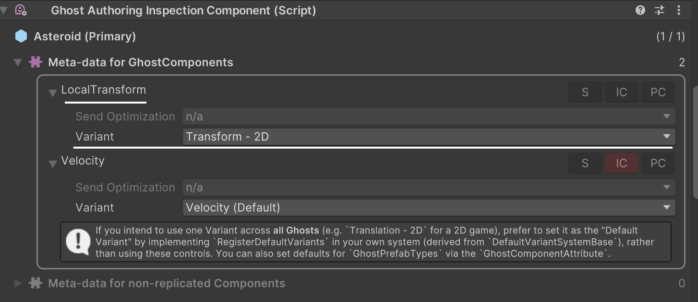
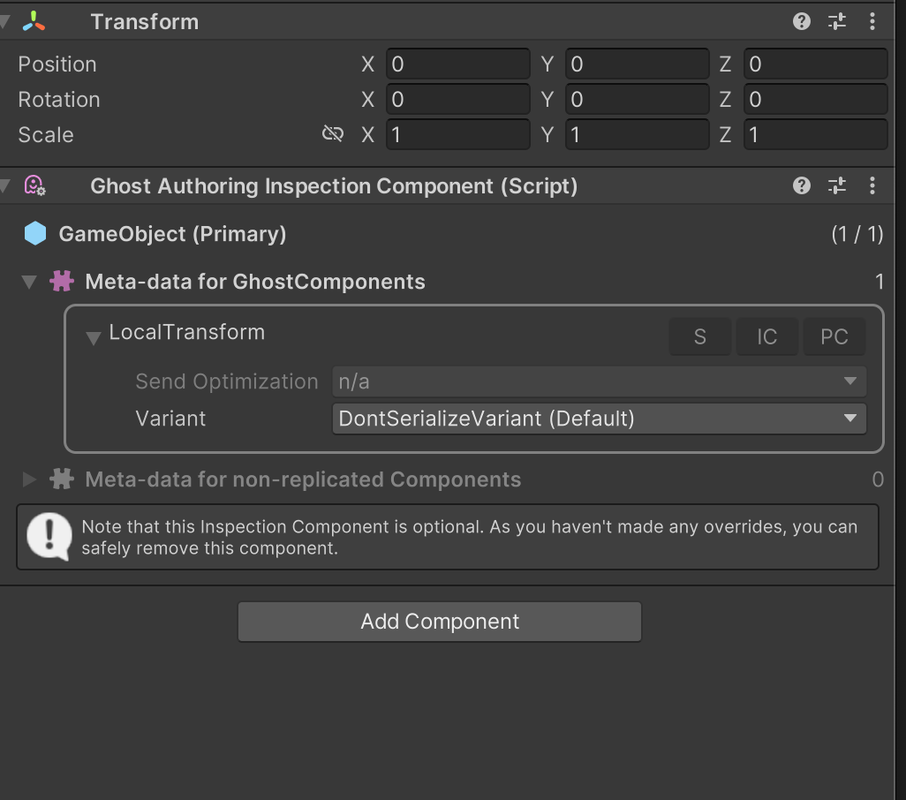

# Ghost snapshots

A ghost is a networked object that the server simulates. During every frame, the server sends a snapshot of the current state of all ghosts to the client. The client presents them, but cannot directly control or affect them because the server owns them.

The ghost snapshot system synchronizes entities which exist on the server to all clients. To make it perform properly, the server processes per ECS chunk rather than per entity. On the receiving side the processing is done per entity. This is because it is not possible to process per chunk on both sides, and the server has more connections than clients.

## Why use Ghosts? Ghosts vs. RPCs

#### Ghost Snapshot Synchronization ("Eventual Consistency") Use-Cases
* To replicate spatially local, ephemeral, and relevant per-entity data.
* To enable client prediction of ghost entities, which is the most effective latency-hiding multiplayer technique.

#### RPC Use-Cases
* High-level game flow events. _Example: Making every client do a certain thing, like load a specific level._
* Sending one-shot, non-predicted commands from the client to the server. _Example: Join this Squad. Send a chat message. Unmute this player. Request to exit this realm. etc._

### Key Differences:
* RPCs are "one-shot" events, and are thus not automatically persisted.
  _Example: If you send an RPC when a treasure chest is opened, if a player disconnects and reconnects, the chest will appear closed._
* Ghost data persists for the lifetime of its Ghost entity (and the lifetime of the ghost entity is itself replicated). Therefore, long-lived user-interactable entities should have their persistent state stored in Ghost components.
  _Example: A chests FSM can be stored as an enum on a Component. If a player opens the chest, disconnects, then reconnects, they will re-receive the chest, as well as its open state._
* RPCs are sent as reliable packets, while ghosts snapshots are unreliable (with "eventual consistency").
* RPC data is sent and received as it is, while ghost data goes through optimizations like diff and delta-compression, and can go through value smoothing when received.
* RPCs are not tied to any particular tick, or other snapshot timing data. They are simply processed on the frame that they are received.
* Ghost snapshot data can work with interpolation and prediction (with snapshot history), and thus history, rollback, and resimulation.
* Ghost snapshot data can be bandwidth optimized via relevancy and importance. RPCs are either broadcast, or sent to a single client.

---

## Authoring Ghosts
Ghost can be authored in the editor by creating a Prefab with a [GhostAuthoringComponent](https://docs.unity3d.com/Packages/com.unity.netcode@latest/index.html?subfolder=/api/Unity.NetCode.GhostAuthoring.html).


The __GhostAuthoringComponent__ has a small editor which you can use to configure how Netcode synchronizes the Prefab. <br/>
You must set the __Name__, __Importance__, __Supported Ghost Mode__, __Default Ghost Mode__ and __Optimization Mode__ property on each ghost. <br/>
Netcode for Entities uses the __Importance__ property to control which entities are sent when there is not enough bandwidth to send all. A higher value makes it more likely that the ghost will be sent.

You can select from three different __Supported Ghost Mode__ types:

* __All__ - this ghost supports both being interpolated and predicted.
* __Interpolated__ - this ghost only supports being interpolated, it cannot be spawned as a predicted ghost.
* __Predicted__ - this ghost only supports being predicted, it cannot be spawned as a interpolated ghost.

You can select from three different __Default Ghost Mode__ types:

* __Interpolated__ - all ghosts Unity receives from the server are treated as interpolated.
* __Predicted__ - all ghosts Unity receives from the server are treated as predicted.
* __Owner predicted__ - the ghost is predicted for the client that owns it, and interpolated for all other clients. When you select this property, you must also add a __GhostOwner__ and set its __NetworkId__ field in your code. Unity compares this field to each clients’ network ID to find the correct owner.

You can select from two different __Optimization Mode__ types:

* __Dynamic__ - the ghost will be optimized for having small snapshot size both when changing and when not changing.
* __Static__ - the ghost will not be optimized for having small snapshot size when changing, but it will not be sent at all when it is not changing.

## Replicating Components and Buffers
Netcode for Entities uses C# attributes to configure which components and fields are synchronized as part of a ghost. There are three fundamental attributes you can use:

| NetCode Attribute                                                                                                                                            | Usage                                                                                                                                                                                                                                                                                                                           |
|--------------------------------------------------------------------------------------------------------------------------------------------------------------|---------------------------------------------------------------------------------------------------------------------------------------------------------------------------------------------------------------------------------------------------------------------------------------------------------------------------------|
| [GhostFieldAttribute](https://docs.unity3d.com/Packages/com.unity.netcode@latest/index.html?subfolder=/api/Unity.NetCode.GhostFieldAttribute.html)           | The `GhostFieldAttribute` should be used to mark which component (or buffer) fields should be serialised. <br/>The attribute can be added to struct fields and properties. <br/>Once a component has at least one field marked with `[GhostField]`, it becomes replicated, and will be transmitted as part of the ghost data.   |
| [GhostEnabledBitAttribute](https://docs.unity3d.com/Packages/com.unity.netcode@latest/index.html?subfolder=/api/Unity.NetCode.GhostEnabledBitAttribute.html) | Similarly, the `GhostEnabledBitAttribute` should be used on an `IEnableableComponent` struct definition, to denote that the enabled bit for this component should be serialized. <br/>Once a component is flagged with `[GhostEnabledBit]`, its enabled-bit will be replicated, and thus transmitted as part of the ghost data. |
| [GhostComponentAttribute](https://docs.unity3d.com/Packages/com.unity.netcode@latest/index.html?subfolder=/api/Unity.NetCode.GhostComponentAttribute.html)   | The `GhostComponentAttribute` should be used on a `ComponentType` struct definition to:<br/>- Declare for which version of the Prefab the component should be present.<br/>- Declare if the component should be serialised also for child entities.<br/>- Declare to which subset of clients a component should be replicated.  |

## Authoring component serialization
To signal the Netcode for Entities that a component should be serialised, you need to add a `[GhostField]` attribute to the values you want to send. 

```csharp
public struct MySerialisedComponent : IComponentData
{
    [GhostField]public int MyIntField;
    [GhostField(Quantization=1000)]public float MyFloatField;
    [GhostField(Quantization=1000, Smoothing=SmoothingAction.Interpolate)]public float2 Position;
    public float2 NonSerialisedField;
    ...
}
```

For a component to support serialization, the following conditions must be met:
* The component itself must be declared as `public`.
* Only `public` members are considered. Adding a `[GhostField]` to a private member has no effect.
* The `GhostField` can specify `Quantization` for floating point numbers (and other supported types, see [Ghost Type Templates](ghost-types-templates.md)). The floating point number will be multiplied by this `Quantization` value, and converted to an integer, in order to save bandwidth. Specifying a `Quantization` is mandatory for floating point numbers. To send a floating point number unquantized; you have to explicitly specify `[GhostField(Quantization=0)]`.
* The `GhostField` `Composite` flag controls how the delta compression computes the change fields bitmask for non primitive fields (i.e. structs). When set to `true`, the delta compression will generate only 1 bit to indicate if the entire struct contains any changes. If `Composite` is false, each field will have its own change-bit. Thus, use `Composite=true` if all fields are typically modified together (example: `GUID`).
* The `GhostField` `SendData` flag (which defaults to `true`) can be used to instruct code-generation to **_not_** include this field in the serialization data. This is particularly useful for non primitive members (like structs), which will have all fields serialized by default.
* The `GhostField` also has a `Smoothing` property, which controls how the field will be updated, when the ghost is in `GhostMode.Interpolated`. I.e. When a given client is not predicting said ghost. Possible values are:
  * `SmoothingAction.Clamp` - Every time a snapshot is received, jump (i.e. clamp) the client value to the latest snapshot value.
  * `SmoothingAction.Interpolate` - Every frame, interpolate the field between the last two snapshot values. If no data is available for the next tick, clamp to the latest value.
  * `SmoothingAction.InterpolateAndExtrapolate` - Every frame, interpolate the field between the last two snapshot values. If no data is available for the next tick, the next value is linearly extrapolated using the previous two snapshot values. Extrapolation is limited (i.e. clamped) via `ClientTickRate.MaxExtrapolationTimeSimTicks`.
* `GhostField` `MaxSmoothingDistance` allows you to disable interpolation when the values change more than the specified limit between two snapshots. This is useful for dealing with teleportation, for example.
* Finally the `GhostField` has a `SubType` property which can be set to an integer value to use special serialization rules supplied for that specific field.

>[!NOTE] Speaking of teleportation: To support _short range_ teleportation, you'd need some other replicated bit to distinguish a teleport from a move (lerp).

## Authoring dynamic buffer serialization
Dynamic buffers serialization is natively supported. **Unlike components, to replicate a buffer, all public fields must be marked with at `[GhostField]` attribute.**
>[!NOTE] This restriction has been added to guarantee that: In the case where an element is added to the buffer, when it is replicated to the client, all fields on said element will have meaningful values. 
> This restriction may be removed in the future (e.g. by instead, defaulting this undefined behaviour to `default(T)`).

```csharp
public struct SerialisedBuffer : IBufferElementData
{
    [GhostField]public int Field0;
    [GhostField(Quantization=1000)]public float Field1;
    [GhostField(Quantization=1000)]public float2 Position;
    public float2 NonSerialisedField; // This is an explicit error!
    private float2 NonSerialisedField; // We allow this. Ensure you set this on the client, before reading from it.
    [GhostField(SendData=false)]public int NotSentAndUninitialised; // We allow this. Ensure you set this on the client, before reading from it.
    ...
}
```

Furthermore, in line with the `IComponentData`:
* The buffer must be declared as `public`.
* Only `public` members are considered. Adding a `[GhostField]` to a private member has no effect.
* By using the `GhostField.SendData` you can instrument the serialisation code to skip certain field. In such a case:
  - the value of the fields that aren't replicated are never altered
  - for new buffer elements, their content is not set to default and the content is undefined (can be any value).

Dynamic buffers fields don't support `SmoothingAction`s. Thus, the `GhostFieldAttribute.Smoothing` and `GhostFieldAttribute.MaxSmoothingDistance` properties will be ignored when used on buffers.


## ICommandData and IInputComponentData serialization

__ICommandData__, being a subclass of __IBufferElementData__, can also be serialized from the server to clients. As such, the same rules for buffers apply: if the command buffer must be serialized, then all fields must be annotated.

```c#
    [GhostComponent()]
    public struct MyCommand : ICommandData
    {
        [GhostField] public NetworkTick Tick {get; set;}
        [GhostField] public int Value;
    }
```

The same applies when using automated input synchronization with __IInputComponentData__.

```c#
    public struct MyCommand : IInputComponentData
    {
        [GhostField] public int Value;
    }
```

The command data serialization is particularly useful for implementing [RemotePlayerPrediction](prediction.md#remote-players-prediction).

### Ghost Field Inheritance
If a `[GhostField]` is specified for a non primitive field type, the attribute (and some of its properties) are automatically inherited by all the sub-fields which do not themselves implement a `[GhostField]` attribute. For example:

```c#

public struct Vector2
{
    public float x;
    [GhostField(Quantization=100)] public float y;
}

public struct MyComponent : IComponentData
{
    //Value.x will inherit the quantization value specified by the parent definition (1000).
    //Value.y will maintain its original quantization value (100).
    [GhostField(Quantized=1000)] public Vector2 Value;
}
```

The following properties are not inherited:
* __SubType__ - The subtype is always reset to the default

---

## Using the GhostComponentAttribute
The `GhostComponentAttribue` **does not indicate or signal** that a component is replicated (that's what the other two attributes are for).
Instead, it should be used to instruct the runtime how to handle the component when it comes to:
- `SendDataForChildEntity` denotes whether or not to replicate this component when it is attached to a child of a ghost entity. Replicating child of ghost entities is significantly slower than replicating those ghost root entities. Thus, we default to `false`. This flag also applies to the `[GhostEnabledBit]`.
- `PrefabType` allows you to remove the component from the specific version of the ghost prefab. Ghost prefabs have three versions: `Interpolated Client (IC)`, `Predicted Client (PC)`, and `Server (S)`. _Example: Removing rendering related components from the server world's version of this ghost._
- `GhostSendType` denotes whether or not the component should be sent when the ghost is `GhostMode.Predicted` vs `GhostMode.Interpolated`. Example: Only sending `PhysicsVelocity` when you're actually predicting the physics of a ghost.
- `SendToOwnerType` denotes whether or not to replicate this data when the ghost is owned, vs not owned, vs either. _Example: Replicating input commands only to other players (as you already know your own)._
 
```csharp
[GhostComponent(PrefabType=GhostPrefabType.All, SendTypeOptimization=GhostSendType.OnlyInterpolatedClients, SendDataForChildEntity=false)]
public struct MyComponent : IComponentData
{  
    [GhostField(Quantized=1000)] public float3 Value;
}
```

#### PrefabType Details
To change which versions of a Ghost Prefab a component is available on, use `PrefabType` in a `GhostComponentAttribute` on the component. `PrefabType` can be on of the these types:
* `InterpolatedClient` - the component is only available on clients, and only when the ghost is interpolated.
* `PredictedClient` - the component is only available on clients, and only when the ghost is predicted.
* `Client` - the component is only available on clients, regardless of the `GhostMode` (e.g. either predicted or interpolated).
* `Server` - the component is only available on the server.
* `AllPredicted` - the component is only available on the server, and on clients, only when the ghost is predicted.
* `All` - the component is available on the server and all clients.

_For example, if you add `[GhostComponent(PrefabType=GhostPrefabType.Client)]` to `RenderMesh`, the ghost won’t have a `RenderMesh` when it is instantiated on the server world, but it will have it when instantiated on the client world._

>[!NOTE] [Runtime Prediction Switching](prediction.md#prediction-switching) therefore has the potential to add and remove components on a ghost, live.

#### SendTypeOptimization Details
A component can set `SendTypeOptimization` in the `GhostComponentAttribute` to control which clients the component is sent to, whenever a ghost type is known at compile time. The available modes are:
* `None` - the component is never sent to any clients. Netcode will not modify the component on the clients which do not receive it.
* `Interpolated` - the component is only sent to clients which are interpolating the ghost.
* `Predicted` - the component is only sent to clients which are predicting the ghost.
* `All` - the component is sent to all clients.

A component can also set __SendDataForChildEntity__ to true in order to change the default (of not serializing children), allowing this component to be serialized when on a child.

A component can also set __SendToOwner__ in the __GhostComponentAttribute__ to specify if the component should be sent to client who owns the entity. The available values are:
* __SendToOwner__ - the component is only sent to the client who own the ghost
* __SendToNonOwner__ - the component is sent to all clients except the one who owns the ghost
* __All__ - the component is sent to all clients.

>[!NOTE] By setting either the `SendTypeOptimisation` and/or `SendToOwner` (to specify to which types of client(s) the component should be replicated to), will not affect the presence of the component on the prefab, nor modify the component on the clients which did not receive it.

---

## How to add serialization support for custom Types
The types you can serialize via `GhostFieldAttribute` are specified via templates. You can see the default supported types [here](ghost-types-templates.md#Supported Types) <br/>  
In addition to the default out-of-the-box types you can also:
- add your own templates for new types.
- provide a custom serialization templates for a types and target by using the _SubTypes_ property of the `GhostFieldAttribute`.

Please check how to [use and write templates](ghost-types-templates.md#Defining additional templates) for more information on the topic.

>[!NOTE] Writing templates is non-trivial. If it is possible to replicate the type simply by adding GhostFields, it's often easier to just do so. If you do not have access to a type, create a Variant instead (see section below).
 
## Ghost Component Variants
The [GhostComponentVariationAttribute](https://docs.unity3d.com/Packages/com.unity.netcode@latest/index.html?subfolder=/api/Unity.NetCode.GhostComponentVariationAttribute.html) is special attribute tha can be used to declare at compile time
a "replication schema" for a type, without the need to markup the fields in the original type, or the original type itself. <br/>

>[!NOTE]This new declared type act as proxy from a code-generation perspective. Instead of using the original type, the code-generation system use the declared "variant" to generate a specific version of the serialization code.

>[!NOTE] **Ghost components variants for `IBufferElementData` are not fully supported.**

The `GhostComponentVariationAttribute` has some specific use-cases in mind:
- Variants allow user-code (you) to declare serialization rules for a component that you don't have direct write access too (_i.e. components in a package or external assembly_). _Example: Making `Unity.Entities.LocalTransform` replicated._
- Generate multiple serialization strategies for a single type (i.e: provide multiple ways to replicate a single type, allowing individual ghosts to select their version). _Example: Replicate only the Yaw value of `Unity.Entities.LocalRotation`, or the full `quaternion`._
- Strip components (i.e: `RenderMesh`) from certain prefab types (_e.g. from the Server_) by overriding or adding a `GhostComponentAttribute` to the type, without changing the original declaration.

```c#
    [GhostComponentVariation(typeof(LocalTransform), "Transform - 2D")]
    [GhostComponent(PrefabType=GhostPrefabType.All, SendTypeOptimization=GhostSendType.AllClients)]
    public struct PositionRotation2d
    {
        [GhostField(Quantization=1000, Smoothing=SmoothingAction.InterpolateAndExtrapolate, SubType=GhostFieldSubType.Translation2D)]
        public float3 Position;
        [GhostField(Quantization=1000, Smoothing=SmoothingAction.InterpolateAndExtrapolate, SubType=GhostFieldSubType.Rotation2D)]
        public quaternion Rotation;
    }
```

In the example above, the `PositionRotation2d` Variation will generate serialization code for `LocalTransform`, using the properties and the attribute present in the variant declaration.

The attribute constructor takes a few arguments:
* The `Type type` of the `ComponentType` you want to specify the variant for (ex: `LocalTransform`).
* The user-friendly `string variantName`, which will allow you to better interpret `GhostAuthoringInspectionComponent` UI.

Then, for each field in the original struct (in this case, `LocalTransform`) that you wish to replicate, you should add a `GhostField` attribute like you usually do, and define the field identically to that of the base struct.
>[!NOTE] Only members that are present in the component type are allowed. Validation occurs at compile time, and exceptions are thrown in case this rule is not respected.

An optional `GhostComponentAttribute` attribute can be added to the variant to further specify the component serialization properties.

It is possible to declare multiple serialization variant for a component (_example: 2D and 3D variations for `LocalRotation`_).

>[!NOTE] If you only define only one Variant for a `ComponentType`, it becomes the default serialization strategy for that type automatically.

### Preventing a component from supporting Variations
There are cases where you'd like to prevent a component from having its serialization modified via Variants.
_Example: From the NetCode package itself, we must always replicate the `GhostComponent` for netcode systems to work properly, so we don't let user-code (you) modify serialization rules for it_).

Thus, to prevent a component from supporting variation, use the [DontSupportPrefabOverridesAttribute](https://docs.unity3d.com/Packages/com.unity.netcode@latest/index.html?subfolder=/api/Unity.NetCode.DontSupportPrefabOverridesAttribute.html) attribute.
An error will be reported at compile time, if a `GhostComponentVariation` is defined for that type.

### Specify which variant to use on a Ghost Prefab
Using the `GhostAuthoringInspectionComponent` `MonoBehaviour` in conjunction with the `GhostAuthoringComponent` `MonoBehaviour`, it is possible to select what serialization variants to use on a per-prefab basis.
You can choose a Variant for each individual component (including the ability to set the special-case variant: `DontSerializeVariant`).



All variants for that specific component type present in the project will be show in a dropbox selection. <br/>
To **_modify_** how children of Ghost prefabs are replicated, add a `GhostAuthoringInspectionComponent` to each individual child.

>[!NOTE] The `GhostAuthoringInspectionComponent` is also an incredibly valuable debugging tool. Add it to a Ghost Prefab (or one of its children) to view all replicated types on said Ghost, and to diagnose why a specific type is not replicating in the way you'd expect.
 
### Assigning a default variant to use for a Type
In cases where multiple variants are present for a type, Netcode may be unable to infer which Variant should be used.
If the "Default Serializer" for the Type is replicated, it'll default to it.
If not, it is considered a conflict, and you'll get runtime exceptions when creating any netcode world (including Baking worlds). 
We use a built-in, deterministic, fallback method to guess which variant you likely want, but, in general, __it is the users responsibility__ to indicate what Variant should be the default here.

To setup which variant to use as the `default` for a given type, you need to create a system that inherits from
[DefaultVariantSystemBase](https://docs.unity3d.com/Packages/com.unity.netcode@latest/index.html?subfolder=/api/Unity.NetCode.DefaultVariantSystemBase.html) class,
and implements the `RegisterDefaultVariants` method.

```c#
using System.Collections.Generic;
using Unity.Entities;
using Unity.Transforms;

namespace Unity.NetCode.Samples
{
    sealed class DefaultVariantSystem : DefaultVariantSystemBase
    {
        protected override void RegisterDefaultVariants(Dictionary<ComponentType, Rule> defaultVariants)
        {
            defaultVariants.Add(typeof(LocalTransform), Rule.OnlyParents(typeof(TransformDefaultVariant)));
        }
    }
}
```

This example code would make sure the default `LocalTransform` variant to us as default is the `TransformDefaultVariant`. For more information, please refer to the
[DefaultVariantSystemBase](https://docs.unity3d.com/Packages/com.unity.netcode@latest/index.html?subfolder=/api/Unity.NetCode.DefaultVariantSystemBase.html) documentation.

>[!NOTE] This is the recommended approach to setup the default Variant for a Ghost "project-wide". Prefer `DefaultVariantSystemBase` over direct Variant manipulation (via the `GhostAuthoringInspectionComponent` overrides).

## Special Variant Types

| Special Built-in Variant | Details                                                                                                                                      |
|--------------------------|----------------------------------------------------------------------------------------------------------------------------------------------|
| `ClientOnlyVariant`      | Use this to specify that a given `ComponentType` should only appear on client worlds.                                                        |
| `ServerOnlyVariant`      | The inverse.                                                                                                                                 |
| `DontSerializeVariant`   | Use this to disable serialization of a Type entirely. I.e. Use it to ignore replication attributes (`[GhostField]` and `[GhostEnabledBit]`). |

```C#
using System.Collections.Generic;
using Unity.Entities;
using Unity.Transforms;

namespace Unity.NetCode.Samples
{
    sealed class DefaultVariantSystem : DefaultVariantSystemBase
    {
        protected override void RegisterDefaultVariants(Dictionary<ComponentType, Rule> defaultVariants)
        {
            defaultVariants.Add(typeof(SomeClientOnlyThing), Rule.ForAll(typeof(ClientOnlyVariant)));
            defaultVariants.Add(typeof(SomeServerOnlyThing), Rule.ForAll(typeof(ServerOnlyVariant)));
            defaultVariants.Add(typeof(NoNeedToSyncThis), Rule.ForAll(typeof(DontSerializeVariant)));
        }
    }
}
```

You can also manually pick the `DontSerializeVariant` in the ghost component on ghost prefabs (via the `GhostAuthoringInspectionComponent`).

## Assign variants and override GhostComponentAttribute settings on ghost prefabs
It is possible to override the following meta-data on per-prefab basis, 
by using the [GhostAuthoringInspectionComponent](https://docs.unity3d.com/Packages/com.unity.netcode@latest/index.html?subfolder=/api/Unity.NetCode.AutoCommandTarget.html) editor.


The `GhostAuthoringInspectionComponent` should be added to the `GameObject` you would like to customise. Once added, the editor will show which components present in the runtime entity are replicated. <br/>
The editor allow you to: change the following properties:

* Change the `PrefabType` in which the component should be present/replicated.
* Change the `SendToOptimization` for this component (if applicable)
* Assign the serialization __Variant__ to use for that component.

It is possible to prevent a component from supporting per-prefab overrides by using the [DontSupportPrefabOverrides](https://docs.unity3d.com/Packages/com.unity.netcode@latest/index.html?subfolder=/api/Unity.NetCode.DontSupportPrefabOverridesAttribute.html)
attribute. <br/>
When present, the component can't be customized in the inspector, nor can a programmer add custom or default variants for this type (as that will trigger errors during ghost validation).

For example: The Netcode for Entities package requires the [GhostOwner](https://docs.unity3d.com/Packages/com.unity.netcode@latest/index.html?subfolder=/api/Unity.NetCode.GhostOwner.html)
to be added to all ghost types, sent for all ghost types, and serialized using the default variant. Thus, we add the `[DontSupportPrefabOverride]` attribute to it.

>[!NOTE] Components on child entities are not serialised by default, thus by default when you look to `GhostAuthoringInspectionComponent` on a child GameObject you will see that the selected variant for the type is the `DontSerializeVariant`.



---

## Snapshot visualization tool

To understand what is being put on the wire in the Netcode, you can use the snapshot visualization tool, __NetDbg__ tool. 


To open the tool, go to menu: __Multiplayer &gt; Open NetDbg__, and the tool opens in a browser window. It displays a vertical bar for each received snapshot, with a breakdown of the snapshot’s ghost types, size etc. 

To see more detailed information about the snapshot, click on one of the bars.

>[!NOTE] This tool is a prototype. In future versions of the package, it will integrate with the Unity Profiler so you can easily correlate network traffic with memory usage and CPU performance.
