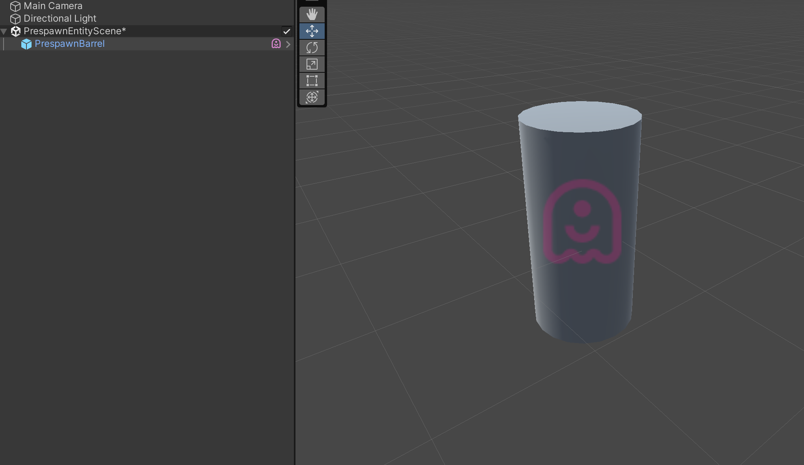

# Spawning Ghost Entities

A ghost is spawned simply by instantiating it on the server, all ghosts on the server are replicated to all clients. Ghosts which are inside subscenes are a special case and handled as pre-spawned ghosts. If their subscene state has not been changed when a client connects he does not need any snapshot data updates for pre-spawned ghosts. On clients ghosts can be predict spawned and later matched with a server spawn as soon as a snapshot update is applied for it. It is not valid to instantiate another type of ghosts on clients as the server is authoritative and is the true authority of what ghosts exists in the world.

## Ghosts Entities on the client
Netcode for Entities does not have and nor does requires a specific spawn message. When the client receives an unknown/new ghost id, it counts as an implicit spawn.

When the client receives a new ghost, the ghost is first "classified" by a set of **classification systems** to determine its **spawning type**.
Once the `spawn type` has been set, the [GhostSpawnSystem](https://docs.unity3d.com/Packages/com.unity.netcode@latest/index.html?subfolder=/api/Unity.NetCode.GhostSpawnSystem.html) will take care of instantiating the new entity.

### Different type of spawning
Spawning is split into three main types as follows:
* __Delayed or interpolated spawning__: Because the client interpolates snapshot data, non predicted ghosts cannot be immediately spawned. Otherwise, the object would appear and then not get any more updates until we receive new data from server and we can start interpolating it. 
<br/>This spawn delay is governed by the `Interpolation Delay`. The interpolated ghosts spawn when the `Interpolated Tick` is greater or equals their spawn tick. See [time synchronization](time-synchronization.md) for more information about interpolation delay and interpolation tick. 
* __Predicted spawning for the client predicted player object__: The object is predicted so the input handling applies immediately. Therefore, it doesn't need to be delay spawned. When the snapshot data for this object arrives, the update system applies the data directly to the object and then plays back the local inputs which have happened since that time, and corrects mistakes in the prediction.
* __Predicted spawning for player spawned objects__: This usually applies to objects that the player spawns, like in-game bullets or rockets that the player fires.

>![NOTE] Ghost entities can be spawned only if the ghost prefabs are loaded/present in the world. Server and client should agree upon the prefabs they have and the server will only report to the client
> ghosts for which the client has the prefab.

### Implement Predicted Spawning for player spawned objects
The spawn code needs to run on the client, in the client prediction system. </br>
Any prefab ghost entity the client instantiates has the __PredictedGhostSpawnRequest__ added to it and is therefore treated as a predict spawned entity by default.

When the first snapshot update for this entity arrives, we detect that the received update is for an entity already spawned by client and from that time on, all the updates will be applied to it.

In the prediction system code the [NetworkTime.IsFirstTimeFullyPredictingTick](https://docs.unity3d.com/Packages/com.unity.netcode@latest/index.html?subfolder=/api/Unity.NetCode.NetworkTime.html) value needs to be checked in order to prevent the spawned object from being spawned multiple times as data is rolled back and redeployed as part of the prediction loop.

```csharp
public void OnUpdate()
{
    // Other input like movement handled here or in another system...

    var networkTime = SystemAPI.GetSingleton<NetworkTime>();
    if (!networkTime.IsFirstTimeFullyPredictingTick)
        return;
    // Handle the input for instantiating a bullet for example here
    // ...
}
```

These client spawned objects are automatically handled by the [GhostSpawnClassificationSystem](https://docs.unity3d.com/Packages/com.unity.netcode@latest/index.html?subfolder=/api/Unity.NetCode.GhostSpawnClassificationSystem.html) system,
that matches the new received ghosts with any of the client predicted spawned ones, based by their types and spawning tick (should be within 5 ticks).

You can implement a custom classification with more advanced logic than this to override the default behaviour.

#### Adding your own classification system
To override the default client classification you can create your own classification system. The system is required to:
- Update in the `GhostSimulationSystemGroup`
- Run after the `GhostSpawnClassificationSystem`

The classification system can inspect the ghosts that need to be spawned by retrieving the
[GhostSpawnBuffer](https://docs.unity3d.com/Packages/com.unity.netcode@latest/index.html?subfolder=/api/Unity.NetCode.GhostSpawnBuffer.html) buffer on the singleton
[GhostSpawnQueueComponent](https://docs.unity3d.com/Packages/com.unity.netcode@latest/index.html?subfolder=/api/Unity.NetCode.GhostSpawnQueue.html) entity and change their __SpawnType__.

Each entry in that list should be compared to the entries in the `PredictedGhostSpawn` buffer on the singleton with a `PredictedGhostSpawnList` component.
If the two entries have the same type and "match", the classification system should set the __PredictedSpawnEntity__ property in the `GhostSpawnBuffer` element and remove the entry from `PredictedGhostSpawn` buffer.

```csharp
public void Execute(DynamicBuffer<GhostSpawnBuffer> ghosts, DynamicBuffer<SnapshotDataBuffer> data)
{
    var predictedSpawnList = PredictedSpawnListLookup[spawnListEntity];
    for (int i = 0; i < ghosts.Length; ++i)
    {
        var newGhostSpawn = ghosts[i];
        if (newGhostSpawn.SpawnType != GhostSpawnBuffer.Type.Predicted || newGhostSpawn.HasClassifiedPredictedSpawn || newGhostSpawn.PredictedSpawnEntity != Entity.Null)
            continue;

        // Mark all the spawns of this type as classified even if not our own predicted spawns
        // otherwise spawns from other players might be picked up by the default classification system when
        // it runs.
        if (newGhostSpawn.GhostType == ghostType)
            newGhostSpawn.HasClassifiedPredictedSpawn = true;

        // Find new ghost spawns (from ghost snapshot) which match the predict spawned ghost type handled by
        // this classification system. You can use the SnapshotDataBufferLookup to inspect components in the 
        // received snapshot in your matching function
        for (int j = 0; j < predictedSpawnList.Length; ++j)
        {
            if (newGhostSpawn.GhostType != predictedSpawnList[j].ghostType)
                continue;
            
            if (YOUR_FUZZY_MATCH(newGhostSpawn, predictedSpawnList[j]))
            {
                newGhostSpawn.PredictedSpawnEntity = predictedSpawnList[j].entity;
                predictedSpawnList[j] = predictedSpawnList[predictedSpawnList.Length - 1];
                predictedSpawnList.RemoveAt(predictedSpawnList.Length - 1);
                break;
            }
        }
        ghosts[i] = newGhostSpawn;
    }
}
```

Inside your classification system you can use the [SnapshotDataBufferLookup](https://docs.unity3d.com/Packages/com.unity.netcode@latest/index.html?subfolder=/api/Unity.NetCode.GhostSpawnQueue.html) to:
- Check for component presence in the ghost archetype
- Retrieve from the snapshot data associated with the new ghost any replicated component type.

## Pre-spawned ghosts
A ghost instance (an instance of a ghost prefab) can be placed in a sub-scene in the Unity editor so that it will be treated just like a normal spawned ghost when the scene is loaded.

To create a prespawned ghost from a normal scene you can do the following:
* Right click on the *Hierarchy* in the inspector and click *New Sub Scene*.
* Drag an instance of a ghost prefab into the newly created subscene.



There are some restrictions for pre-spawned ghosts:
- **It must be an instance of a ghost prefab**.
- **It must be place in a sub-scene**.
- **Pre-spawned ghosts in the same scene cannot have the exact same position and rotation**.
- **Pre-spawned ghosts MUST always be placed on the main scene section (section 0).**
- The ghost authoring component on the pre-spawned ghost cannot be configured differently than the ghost prefab source (that data is handled on a ghost type basis).

### How pre-spawned ghosts works

At baking time, each sub-scene assigns a `PreSpawnedGhostIndex` to the ghosts it contains which are just unique IDs for the ghosts within the subscene they are in. The IDs are assigned by sorting the ghost by means of a deterministic hash that takes in account the `Rotation` and `Translation` of the entity. As well as the ghost type or prefab ID and the SceneGUID of the scene section. This is done because prespawned ghosts cannot be given unique ghost IDs at bake/build time.

For each sub-scene then, a combined hash that contains all the ghosts calculated hashes is extracted and used to:

- group the pre-spawned ghost on a per-sub-scene basis by assigning a `SubSceneGhostComponentHash` shared component to all the ghosts in the scene
- add to the first `SceneSection` in the sub-scene a `SubSceneWithPrespawnGhosts` component, that will be used by the runtime to handle sub-scene with pre-spawned ghosts.

At runtime, when a sub-scene has been loaded, it is processed by both client and server:

- For each pre-spawned ghost, a `Prespawn Baseline` is extracted and used to delta compress the ghost component when it is first sent (bandwidth optimization).
- The server assign to sub-scenes a unique `Ghost Id Range` that is used to assign distinct ghost-id to the pre-spawned ghosts based on their `PreSpawnedGhostIndex`.
- The server will replicated to the client by using an internal ghost entity, the assigned id ranges for each sub-scene (identified by the hash assigned to the `SubSceneWithPrespawnGhosts` component).
- Once the client has loaded the sub-scene and received the ghost range, it will then:
  - Assign to the pre-spawned ghosts the server authoritative IDs.
  - Report to the server it is ready to stream the pre-spawned ghosts (via RPC).

>![NOTE] If prespawned ghosts are moved before going in game or in general before the baseline is calculated properly, data may be not replicated correctly (the snapshot delta compression will fail). 
> Both server and client calculate a CRC of the baseline and this hash is validated when clients connect. A mismatch will cause a disconnection. This is also the reason why the ghost are `Disabled` when the scene is loaded.

>![NOTE] All the prespawn ghost ID setup described here is done automatically so nothing special needs to be done in order to keep them in sync between client and server.

For both client and server, when a sub-scene has been processed (ghost ID assigned) a `PrespawnsSceneInitialized`
internal component is added to the main `SceneSection`. </br>
The client automatically tracks when sub-scene with pre-spawned ghosts are loaded/unloaded and reports to the server to stop streaming pre-spawned ghosts associated with them.

### Dynamic loading sub-scene with pre-spawned ghosts

It is possible to load at runtime a sub-scene with pre-spawned ghosts while you are already `in-game`. The pre-spawned ghosts will be automatically handled and synchronized. It also possible to unload sub-scenes that
contains pre-spawned ghosts on demand. Netcode for Entities will handle that automatically, and the server will stop reporting the pre-spawned ghosts for sections the client has unloaded.

>![NOTE] Pre-spawned ghost when baked become `Disabled` (the `Disable` tag is added to the entity at baking time). The entity is re-enabled after the scene is loaded and the serialization baseline has been calculated.

You can get more information about the pre-spawned ghost synchronization flow, by checking the API documentation:
- [ClientPopulatePrespawnedGhostsSystem](https://docs.unity3d.com/Packages/com.unity.netcode@latest/index.html?subfolder=/api/Unity.NetCode.ClientPopulatePrespawnedGhostsSystem.html)
- [ClientTrackLoadedPrespawnSections](https://docs.unity3d.com/Packages/com.unity.netcode@latest/index.html?subfolder=/api/Unity.NetCode.ClientTrackLoadedPrespawnSections.html)
- [ServerPopulatePrespawnedGhostsSystem](https://docs.unity3d.com/Packages/com.unity.netcode@latest/index.html?subfolder=/api/Unity.NetCode.ServerPopulatePrespawnedGhostsSystem.html)
- [ServerTrackLoadedPrespawnSections](https://docs.unity3d.com/Packages/com.unity.netcode@latest/index.html?subfolder=/api/Unity.NetCode.ServerTrackLoadedPrespawnSections.html)
