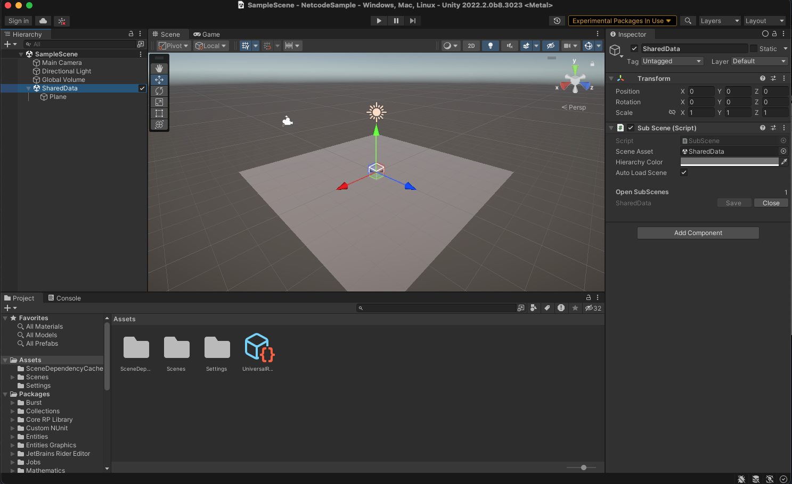
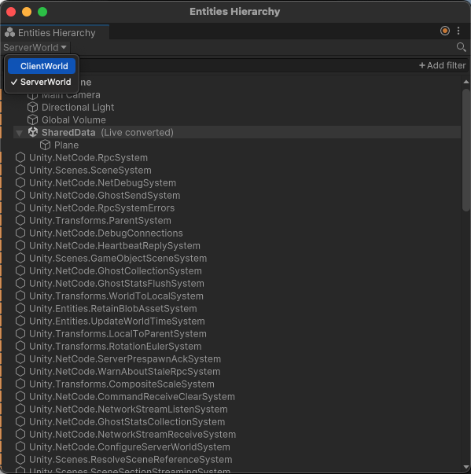
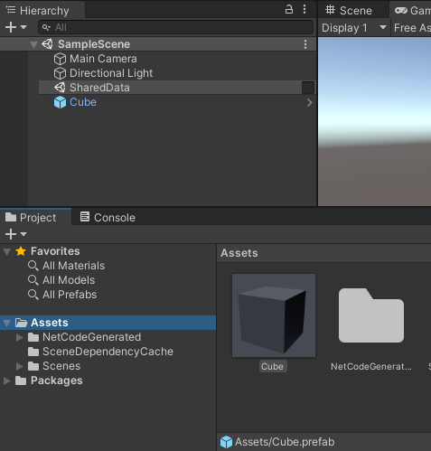
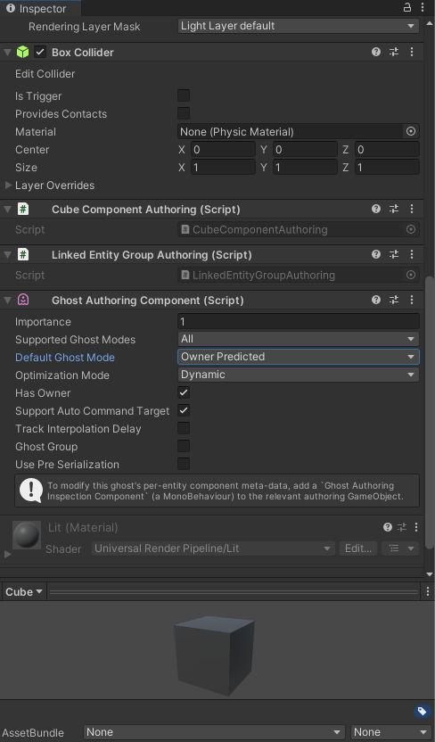
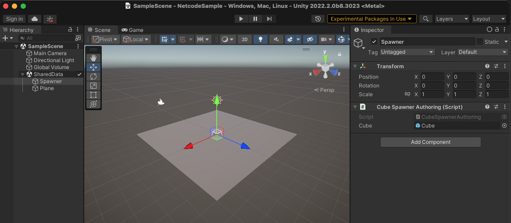
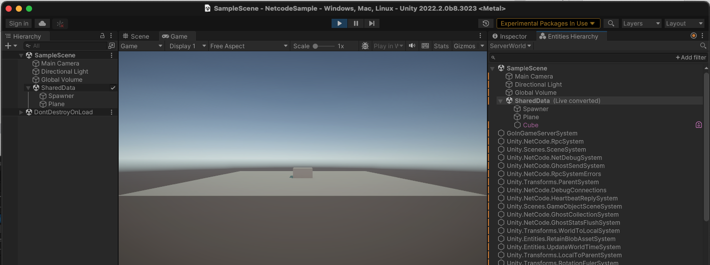

# Networked Cube

Make sure you have set up the project correctly using the [installation guide](installation.md) before starting your adventure (of creating a simple client-server based simulation).

This tutorial briefly introduces the most common concepts involved in making client-server based games.

## Creating an initial Scene

To begin, set up a way to share data between the client and the server. We achieve this separation in Netcode for Entities by creating [a different World](client-server-worlds.md) for the server and each client (via the [Entities Package](https://docs.unity3d.com/Packages/com.unity.entities@latest)). To share data between the server and the client:

1. Right-click within the Hierarchy window in the Unity Editor.
2. Select __New Subscene > Empty Scene__...
3. Name the new scene "SharedData".


<p>

Once this is set up , we want to spawn a plane in both the client and the server world. To do this, right click the __SharedData__ Sub Scene and select __3D Object &gt; Plane__ which then creates a planes nested under __SharedData__.

<br/>_Scene with a plane_

If you select Play, then select __Window > Entities > Hierarchy__, you can see two worlds (ClientWorld and ServerWorld), each with the SharedData Scene with the Plane that you just created.

<br/>_Hierarchy View_

## Establish a connection

To enable communication between the client and server, you need to establish a [connection](network-connection.md). In Netcode for Entities, the simplest way of achieving this is to use the auto-connect feature. You can use the auto-connect feature by inheriting from the `ClientServerBootstrap`, then setting the `AutoConnectPort` to your chosen port.

Create a file called *Game.cs* in your __Assets__ folder and add the following code to the file:

```c#
using System;
using Unity.Entities;
using Unity.NetCode;

// Create a custom bootstrap, which enables auto-connect.
// The bootstrap can also be used to configure other settings as well as to
// manually decide which worlds (client and server) to create based on user input
[UnityEngine.Scripting.Preserve]
public class GameBootstrap : ClientServerBootstrap
{
    public override bool Initialize(string defaultWorldName)
    {
        AutoConnectPort = 7979; // Enabled auto connect
        return base.Initialize(defaultWorldName); // Use the regular bootstrap
    }
}
```

## Communicate with the server

When you are connected, you can start communication. A critical concept in Netcode for Entities is the concept of `InGame`. When a connection is marked with `InGame` it tells the simulation its ready to start [synchronizing](synchronization.md).

You communicate with Netcode for Entities by using `RPC`s. So to continue create a RPC that acts as a "Go In Game" message, (for example, tell the server that you are ready to start receiving [snapshots](ghost-snapshots.md)).

Create a file called *GoInGame.cs* in your __Assets__ folder and add the following code to the file.

```c#
using UnityEngine;
using Unity.Collections;
using Unity.Entities;
using Unity.NetCode;
using Unity.Burst;

/// <summary>
/// This allows sending RPCs between a stand alone build and the editor for testing purposes in the event when you finish this example
/// you want to connect a server-client stand alone build to a client configured editor instance. 
/// </summary>
[BurstCompile]
[WorldSystemFilter(WorldSystemFilterFlags.ClientSimulation | WorldSystemFilterFlags.ServerSimulation | WorldSystemFilterFlags.ThinClientSimulation)]
[UpdateInGroup(typeof(InitializationSystemGroup))]
[CreateAfter(typeof(RpcSystem))]
public partial struct SetRpcSystemDynamicAssemblyListSystem : ISystem
{
    public void OnCreate(ref SystemState state)
    {
        SystemAPI.GetSingletonRW<RpcCollection>().ValueRW.DynamicAssemblyList = true;
        state.Enabled = false;
    }
}

// RPC request from client to server for game to go "in game" and send snapshots / inputs
public struct GoInGameRequest : IRpcCommand
{
}

// When client has a connection with network id, go in game and tell server to also go in game
[BurstCompile]
[WorldSystemFilter(WorldSystemFilterFlags.ClientSimulation | WorldSystemFilterFlags.ThinClientSimulation)]
public partial struct GoInGameClientSystem : ISystem
{
    [BurstCompile]
    public void OnCreate(ref SystemState state)
    {
        var builder = new EntityQueryBuilder(Allocator.Temp)
            .WithAll<NetworkId>()
            .WithNone<NetworkStreamInGame>();
        state.RequireForUpdate(state.GetEntityQuery(builder));
    }

    [BurstCompile]
    public void OnUpdate(ref SystemState state)
    {
        var commandBuffer = new EntityCommandBuffer(Allocator.Temp);
        foreach (var (id, entity) in SystemAPI.Query<RefRO<NetworkId>>().WithEntityAccess().WithNone<NetworkStreamInGame>())
        {
            commandBuffer.AddComponent<NetworkStreamInGame>(entity);
            var req = commandBuffer.CreateEntity();
            commandBuffer.AddComponent<GoInGameRequest>(req);
            commandBuffer.AddComponent(req, new SendRpcCommandRequest { TargetConnection = entity });
        }
        commandBuffer.Playback(state.EntityManager);
    }
}

// When server receives go in game request, go in game and delete request
[BurstCompile]
[WorldSystemFilter(WorldSystemFilterFlags.ServerSimulation)]
public partial struct GoInGameServerSystem : ISystem
{
    private ComponentLookup<NetworkId> networkIdFromEntity;

    [BurstCompile]
    public void OnCreate(ref SystemState state)
    {
        var builder = new EntityQueryBuilder(Allocator.Temp)
            .WithAll<GoInGameRequest>()
            .WithAll<ReceiveRpcCommandRequest>();
        state.RequireForUpdate(state.GetEntityQuery(builder));
        networkIdFromEntity = state.GetComponentLookup<NetworkId>(true);
    }

    [BurstCompile]
    public void OnUpdate(ref SystemState state)
    {
        var worldName = state.WorldUnmanaged.Name;

        var commandBuffer = new EntityCommandBuffer(Allocator.Temp);
        networkIdFromEntity.Update(ref state);

        foreach (var (reqSrc, reqEntity) in SystemAPI.Query<RefRO<ReceiveRpcCommandRequest>>().WithAll<GoInGameRequest>().WithEntityAccess())
        {
            commandBuffer.AddComponent<NetworkStreamInGame>(reqSrc.ValueRO.SourceConnection);
            var networkId = networkIdFromEntity[reqSrc.ValueRO.SourceConnection];

            Debug.Log($"'{worldName}' setting connection '{networkId.Value}' to in game");

            commandBuffer.DestroyEntity(reqEntity);
        }
        commandBuffer.Playback(state.EntityManager);
    }

}

```

## Create a ghost Prefab

To synchronize something across a client/server setup, you need to create a definition of the networked object, called a **ghost**.

To create a ghost Prefab:

1. Create a cube in the Scene by right-clicking on the Scene, then selecting __3D Object > Cube__).
2. Select the __Cube GameObject__ under the __Scene__ and drag it into the Project’s __Asset__ folder. This creates a Prefab of the Cube.
3. After creating the Prefab, you can delete the cube from the scene, but __do not__ delete the Prefab.

<br/>_Create a Cube Prefab_

To identify and synchronize the Cube Prefab inside Netcode for Entities, you need to create a `IComponent` and Author it. To do so create a new file called *CubeAuthoring.cs* and we enter the following:

```c#
using Unity.Entities;
using UnityEngine;

public struct Cube : IComponentData
{
}

[DisallowMultipleComponent]
public class CubeAuthoring : MonoBehaviour
{
    class Baker : Baker<CubeAuthoring>
    {
        public override void Bake(CubeAuthoring authoring)
        {
            var entity = GetEntity(TransformUsageFlags.Dynamic);
            AddComponent<Cube>(entity);
        }
    }
}
```

Once you create this component, add it to the Cube Prefab. <p>Then, in the Inspector, add the __Ghost Authoring Component__ to the Prefab.

When you do this, Unity will automatically serialize the Translation and Rotation components.

Before you can move the cube around, you must change some settings in the newly added __Ghost Authoring Component__:

1. Check the __Has Owner__ box. This automatically adds and checks a new property called _Support Auto Command Target_ (more on this later).
2. Change the __Default Ghost Mode to Owner Predicted__. You need to set the __NetworkId__ member of the __Ghost Owner Component__ in your code (more on this later). This makes sure that you predict your own movement.

<br/>_The Ghost Authoring component_


## Create a spawner
To tell Netcode for Entities which Ghosts to use, you need to reference the prefabs from the sub-scene. First, create a new component for the spawner: create a file called _CubeSpawnerAuthoring.cs_ and add the following code:

```c#
using Unity.Entities;
using UnityEngine;

public struct CubeSpawner : IComponentData
{
    public Entity Cube;
}

[DisallowMultipleComponent]
public class CubeSpawnerAuthoring : MonoBehaviour
{
    public GameObject Cube;

    class Baker : Baker<CubeSpawnerAuthoring>
    {
        public override void Bake(CubeSpawnerAuthoring authoring)
        {
            CubeSpawner component = default(CubeSpawner);
            component.Cube = GetEntity(authoring.Cube, TransformUsageFlags.Dynamic);
            var entity = GetEntity(TransformUsageFlags.Dynamic);
            AddComponent(entity, component);
        }
    }
}
```

1. Right-click on SharedData and select __Create Empty__.
2. Rename it to __Spawner__, then add a __CubeSpawner__.
3. Because both the client and the server need to know about these Ghosts, add it to the __SharedData Sub Scene__.
4. In the Inspector, drag the Cube prefab to the Cube field of the spawner.

<br/>_Ghost Spawner settings_

## Spawning our prefab

To spawn the prefab, you need to update the _GoInGame.cs_ file. If you recall from earlier, you must send a __GoInGame__ `RPC` when you are ready to tell the server to start synchronizing. You can update that code to actually spawn our cube as well.

### Update GoInGameClientSystem and GoInGameServerSystem
We want the `GoInGameClientSystem` and `GoInGameServerSystem` to only run on the entities that have `CubeSpawner` component data associated with them. In order to do this we will add a call to [`SystemState.RequireForUpdate`](https://docs.unity3d.com/Packages/com.unity.entities@1.0/api/Unity.Entities.SystemState.RequireForUpdate.html) in both systems' `OnCreate` method:

```C#
state.RequireForUpdate<CubeSpawner>();
```

Your `GoInGameClientSystem.OnCreate` method should look like this now:

```C#
    [BurstCompile]
    public void OnCreate(ref SystemState state)
    {
        // Run only on entities with a CubeSpawner component data 
        state.RequireForUpdate<CubeSpawner>();

        var builder = new EntityQueryBuilder(Allocator.Temp)
            .WithAll<NetworkId>()
            .WithNone<NetworkStreamInGame>();
        state.RequireForUpdate(state.GetEntityQuery(builder));
    }
```

Your `GoInGameServerSystem.OnCreate` method should look like this now:

```C#
    [BurstCompile]
    public void OnCreate(ref SystemState state)
    {
        state.RequireForUpdate<CubeSpawner>();
        var builder = new EntityQueryBuilder(Allocator.Temp)
            .WithAll<GoInGameRequest>()
            .WithAll<ReceiveRpcCommandRequest>();
        state.RequireForUpdate(state.GetEntityQuery(builder));
        networkIdFromEntity = state.GetComponentLookup<NetworkId>(true);
    }
```
Additionally, for the `GoInGameServerSystem.OnUpdate` method we want to:
- Get the prefab to spawn
  - As an added example, get the name of the prefab being spawned to add to the log message
- For each inbound `ReceiveRpcCommandRequest` message, we will instantiate an instance of the prefab.
  - For each prefab instance we will set the `GhostOwner.NetworkId` value to the NetworkId of the requesting client.
- Finally we will add the newly instantiated instance to the `LinkedEntityGroup` so when the client disconnects the entity will be destroyed.

Update your `GoInGameServerSystem.OnUpdate` method to this:

```C#
    [BurstCompile]
    public void OnUpdate(ref SystemState state)
    {
        // Get the prefab to instantiate
        var prefab = SystemAPI.GetSingleton<CubeSpawner>().Cube;
        
        // Ge the name of the prefab being instantiated
        state.EntityManager.GetName(prefab, out var prefabName);
        var worldName = new FixedString32Bytes(state.WorldUnmanaged.Name);

        var commandBuffer = new EntityCommandBuffer(Allocator.Temp);
        networkIdFromEntity.Update(ref state);

        foreach (var (reqSrc, reqEntity) in SystemAPI.Query<RefRO<ReceiveRpcCommandRequest>>().WithAll<GoInGameRequest>().WithEntityAccess())
        {
            commandBuffer.AddComponent<NetworkStreamInGame>(reqSrc.ValueRO.SourceConnection);
            // Get the NetworkId for the requesting client
            var networkId = networkIdFromEntity[reqSrc.ValueRO.SourceConnection];

            // Log information about the connection request that includes the client's assigned NetworkId and the name of the prefab spawned.
            UnityEngine.Debug.Log($"'{worldName}' setting connection '{networkId.Value}' to in game, spawning a Ghost '{prefabName}' for them!");

            // Instantiate the prefab
            var player = commandBuffer.Instantiate(prefab);
            // Associate the instantiated prefab with the connected client's assigned NetworkId
            commandBuffer.SetComponent(player, new GhostOwner { NetworkId = networkId.Value});

            // Add the player to the linked entity group so it is destroyed automatically on disconnect
            commandBuffer.AppendToBuffer(reqSrc.ValueRO.SourceConnection, new LinkedEntityGroup{Value = player});
            commandBuffer.DestroyEntity(reqEntity);
        }
        commandBuffer.Playback(state.EntityManager);
    }
```


Your **GoInGame.cs** file should now look like this:

```C#
using UnityEngine;
using Unity.Collections;
using Unity.Entities;
using Unity.NetCode;
using Unity.Burst;

/// <summary>
/// This allows sending RPCs between a stand alone build and the editor for testing purposes in the event when you finish this example
/// you want to connect a server-client stand alone build to a client configured editor instance. 
/// </summary>
[BurstCompile]
[WorldSystemFilter(WorldSystemFilterFlags.ClientSimulation | WorldSystemFilterFlags.ServerSimulation | WorldSystemFilterFlags.ThinClientSimulation)]
[UpdateInGroup(typeof(InitializationSystemGroup))]
[CreateAfter(typeof(RpcSystem))]
public partial struct SetRpcSystemDynamicAssemblyListSystem : ISystem
{
    public void OnCreate(ref SystemState state)
    {
        SystemAPI.GetSingletonRW<RpcCollection>().ValueRW.DynamicAssemblyList = true;
        state.Enabled = false;
    }
}

// RPC request from client to server for game to go "in game" and send snapshots / inputs
public struct GoInGameRequest : IRpcCommand
{
}

[BurstCompile]
[WorldSystemFilter(WorldSystemFilterFlags.ClientSimulation | WorldSystemFilterFlags.ThinClientSimulation)]
public partial struct GoInGameClientSystem : ISystem
{
    [BurstCompile]
    public void OnCreate(ref SystemState state)
    {
        // Run only on entities with a CubeSpawner component data 
        state.RequireForUpdate<CubeSpawner>();

        var builder = new EntityQueryBuilder(Allocator.Temp)
            .WithAll<NetworkId>()
            .WithNone<NetworkStreamInGame>();
        state.RequireForUpdate(state.GetEntityQuery(builder));
    }

    [BurstCompile]
    public void OnUpdate(ref SystemState state)
    {
        var commandBuffer = new EntityCommandBuffer(Allocator.Temp);
        foreach (var (id, entity) in SystemAPI.Query<RefRO<NetworkId>>().WithEntityAccess().WithNone<NetworkStreamInGame>())
        {
            commandBuffer.AddComponent<NetworkStreamInGame>(entity);
            var req = commandBuffer.CreateEntity();
            commandBuffer.AddComponent<GoInGameRequest>(req);
            commandBuffer.AddComponent(req, new SendRpcCommandRequest { TargetConnection = entity });
        }
        commandBuffer.Playback(state.EntityManager);
    }
}

[BurstCompile]
// When server receives go in game request, go in game and delete request
[WorldSystemFilter(WorldSystemFilterFlags.ServerSimulation)]
public partial struct GoInGameServerSystem : ISystem
{
    private ComponentLookup<NetworkId> networkIdFromEntity;

    [BurstCompile]
    public void OnCreate(ref SystemState state)
    {
        state.RequireForUpdate<CubeSpawner>();
        var builder = new EntityQueryBuilder(Allocator.Temp)
            .WithAll<GoInGameRequest>()
            .WithAll<ReceiveRpcCommandRequest>();
        state.RequireForUpdate(state.GetEntityQuery(builder));
        networkIdFromEntity = state.GetComponentLookup<NetworkId>(true);
    }

    [BurstCompile]
    public void OnUpdate(ref SystemState state)
    {
        // Get the prefab to instantiate
        var prefab = SystemAPI.GetSingleton<CubeSpawner>().Cube;
        
        // Ge the name of the prefab being instantiated
        state.EntityManager.GetName(prefab, out var prefabName);
        var worldName = new FixedString32Bytes(state.WorldUnmanaged.Name);

        var commandBuffer = new EntityCommandBuffer(Allocator.Temp);
        networkIdFromEntity.Update(ref state);

        foreach (var (reqSrc, reqEntity) in SystemAPI.Query<RefRO<ReceiveRpcCommandRequest>>().WithAll<GoInGameRequest>().WithEntityAccess())
        {
            commandBuffer.AddComponent<NetworkStreamInGame>(reqSrc.ValueRO.SourceConnection);
            // Get the NetworkId for the requesting client
            var networkId = networkIdFromEntity[reqSrc.ValueRO.SourceConnection];

            // Log information about the connection request that includes the client's assigned NetworkId and the name of the prefab spawned.
            UnityEngine.Debug.Log($"'{worldName}' setting connection '{networkId.Value}' to in game, spawning a Ghost '{prefabName}' for them!");

            // Instantiate the prefab
            var player = commandBuffer.Instantiate(prefab);
            // Associate the instantiated prefab with the connected client's assigned NetworkId
            commandBuffer.SetComponent(player, new GhostOwner { NetworkId = networkId.Value});

            // Add the player to the linked entity group so it is destroyed automatically on disconnect
            commandBuffer.AppendToBuffer(reqSrc.ValueRO.SourceConnection, new LinkedEntityGroup{Value = player});
            commandBuffer.DestroyEntity(reqEntity);
        }
        commandBuffer.Playback(state.EntityManager);
    }
}
```

If you press Play now, you should see the replicated cube in the game view and the Entity Hierarchy view.

<br/>_Replicated Cube_

## Moving the Cube

Because you used the _Support Auto Command Target_ feature when you set up the ghost component, you can take advantage of the `IInputComponentData` struct for storing input data. This struct dictates what you will be serializing and deserializing as the input data. You also need to create a System that will fill in our input data.

Create a script called *CubeInputAuthoring.cs* and add the following code:

```c#
using Unity.Entities;
using Unity.NetCode;
using UnityEngine;

public struct CubeInput : IInputComponentData
{
    public int Horizontal;
    public int Vertical;
}

[DisallowMultipleComponent]
public class CubeInputAuthoring : MonoBehaviour
{
    class Baking : Baker<CubeInputAuthoring >
    {
        public override void Bake(CubeInputAuthoring authoring)
        {
            var entity = GetEntity(TransformUsageFlags.Dynamic);
            AddComponent<CubeInput>(entity);
        }
    }
}

[UpdateInGroup(typeof(GhostInputSystemGroup))]
public partial struct SampleCubeInput : ISystem
{
    public void OnUpdate(ref SystemState state)
    {
        bool left = UnityEngine.Input.GetKey("left");
        bool right = UnityEngine.Input.GetKey("right");
        bool down = UnityEngine.Input.GetKey("down");
        bool up = UnityEngine.Input.GetKey("up");
        
        foreach (var playerInput in SystemAPI.Query<RefRW<CubeInput>>().WithAll<GhostOwnerIsLocal>())
        {
            playerInput.ValueRW = default;
            if (left)
                playerInput.ValueRW.Horizontal -= 1;
            if (right)
                playerInput.ValueRW.Horizontal += 1;
            if (down)
                playerInput.ValueRW.Vertical -= 1;
            if (up)
                playerInput.ValueRW.Vertical += 1;
        }
    }
}
```

Add the `CubeInputAuthoring` component to your Cube Prefab, and then finally, create a system that can read the `CubeInput` and move the player.

Create a new file script called `CubeMovementSystem.cs` and add the following code: 

```c#
using Unity.Entities;
using Unity.Mathematics;
using Unity.NetCode;
using Unity.Transforms;
using Unity.Burst;

[UpdateInGroup(typeof(PredictedSimulationSystemGroup))]
[BurstCompile]
public partial struct CubeMovementSystem : ISystem
{
    
    [BurstCompile]
    public void OnUpdate(ref SystemState state)
    {
        var speed = SystemAPI.Time.DeltaTime * 4;
        foreach (var (input, trans) in SystemAPI.Query<RefRO<CubeInput>, RefRW<LocalTransform>>().WithAll<Simulate>())
        {
            var moveInput = new float2(input.ValueRO.Horizontal, input.ValueRO.Vertical);
            moveInput = math.normalizesafe(moveInput) * speed;
            trans.ValueRW.Position += new float3(moveInput.x, 0, moveInput.y);
        }
    }
}
```

## Test the code

Now you have set up your code, open __Multiplayer &gt; PlayMode Tools__ and set the __PlayMode Type__ to __Client & Server__. Enter Play Mode, and the Cube spawns. Press the __Arrow__ keys to move the Cube around.


## Build Stand Alone Build & Connect an Editor-Based Client
Now that you have the server-client instance running in the editor, you might want to see what it would be like to test connecting another client. In order to do this follow these steps:
- Verify that your Project Settings --> Entities --> Build --> NetCode Client Target is set to *ClientAndServer*.
- Make a development build and run that stand alone build.
- Select the Multiplayer menu bar option and select the editor play mode tools window.
  - Set the **PlayMode Type** to: Client
  - Set the **Auto Connect Port** to: 7979
  - Optionally you can dock or close this window at this point.
- Enter into PlayMode

You should now see on your server-client stand alone build the editor-based client's cube and be able to see both cubes move around!

