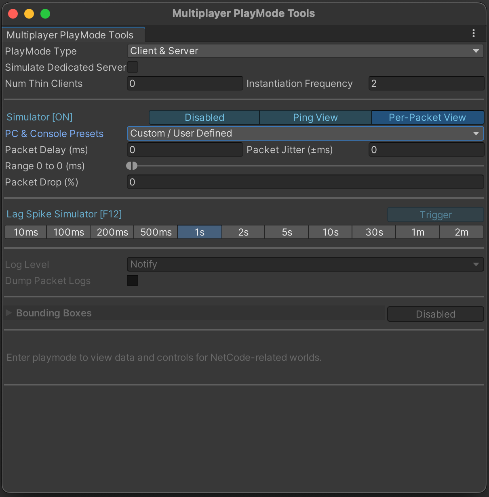
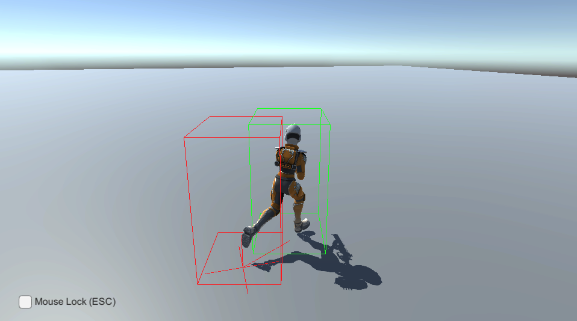

# PLAY MODE TOOL WINDOW
The __PlayMode Tools__ window in the Unity Editor provide a set of utility to:
- select what type of mode (client, server, client/server) you would like the game start. 
- enable and configure the [network simulator](network-connection.md#network-simulator).
- configure the number of [thin-clients](client-server-worlds.md#thin-clients) to use.
- changing the current logging level and enabling packet dumps.
- connect/disconnect clients when in play-mode
- showing bounding box gizmos.

You can access __PlayMode Tools__, go to menu: __Multiplayer &gt; PlayMode Tools__.

| **Property**                  | **Description**                                                                                                                                                                                                       |
|-------------------------------|-----------------------------------------------------------------------------------------------------------------------------------------------------------------------------------------------------------------------|
| __PlayMode Type__             | Choose to make Play Mode either __Client__ only, __Server__ only, or __Client & Server__.                                                                                                                             |
| __Num Thin Clients__          | Set the number of thin clients. Thin clients cannot be presented, and never spawn any entities it receives from the server. However, they can generate fake input to send to the server to simulate a realistic load. |
| __Simulate_Dedicated_Server__ | When enabled, in the editor the sub-scene for the server world are baked using the server settings.                                                                                                                   |

When you enter Play Mode, from this window you can also connect and disconnect clients. 
When you change a client that Unity is presenting, it stops calling the update on the `ClientPresentationSystemGroup` for the Worlds which it should no longer present. As such, your code needs to be able to handle this situation, or your presentation code won’t run and all rendering objects you’ve created still exist.

## NetworkSimulator
The Network Simulator can be used to simulate some network condition while running your game in the editor. 
Once the simulator is enabled, you can set the packet delay, drop either manually (by setting your own value) or by selecting some provided `presets` (i.e 4G, Broadband, etc.).

You can also specify your own settings, by setting custom values in the `RTT Delay`, `RTT Jitter` `PacketDrop` fields (or `Packet Delay`, `Packet Jitter` for `Packet View`).

| **Property**                           | **Description**                                                                                                                                                                                                                                                                         |
|----------------------------------------|-----------------------------------------------------------------------------------------------------------------------------------------------------------------------------------------------------------------------------------------------------------------------------------------|
| __RTT Delay (ms)__                     | Use this property to emulate round trip time. The property delay the incoming and outgoing packet (in ms) such that the sum of the delays equals the specified value.                                                                                                                   |
| __RTT Jitter (ms)__                    | Use this property to add (or subtract) a random value to the delay, which makes the delay a value between the delay you have set plus or minus the jitter value. For example, if you set __RTTDelay__ to 45 and __RTTJitter__ to 5, you will get a random value between 40 and 50.      |
| __Packet Drop (%)__                    | Use this property to simulate bad connections where not all packets arrive. Specify a value (as a percentage) and Netcode discards that percentage of packets from the total it receives. For example, set the value to 5 and Netcode discards 5% of all incoming and outgoing packets. |
| __Packet Fuzz (%)__                    | Use this property to simulate security-related MitM attacks, where malicious clients will attempt to bring down your server (or other clients) by intentionally serializing bad data.                                                                                                   |
| __Auto Connect Address (Client only)__ | Specify which server a client should connect to. This field only appears if you set __PlayMode Type__ to __Client__. The user code needs to read this value and connect because the connection flows are in user code.                                                                  |
| __Auto Connect Port (Client only)__    | Override and/or specify which port to use for both listening (server) and connecting (client)                                                                                                                                                                                           |

> [!NOTE]
> These simulator settings are applied on a per-packet basis (i.e. each way). 
> [!NOTE]
> Enabling network simulation will force the Unity Transport's network interface to be a full UDP socket. Otherwise, when a both Client and Server worlds are present in the same process an IPC (Inter-Process Communication) connection is used instead.
> See [DefaultDriverConstructor](https://docs.unity3d.com/Packages/com.unity.netcode@latest/index.html?subfolder=/api/Unity.NetCode.IPCAndSocketDriverConstructor.html)  
> [!NOTE]
> The `AutoConnectAddress` and `AutoConnectPort` will be used when automatically connecting the client to a server (in client only mode) and overrides the values set in the [ClientServerBootstrap](https://docs.unity3d.com/Packages/com.unity.netcode@latest/index.html?subfolder=/api/Unity.NetCode.ClientServerBootstrap.html). However, when the bootstrap sets `AutoConnectPort` to 0 these fields will be unused unless the Connect button in the Playmode Tools is pressed.

We strongly recommend that you frequently test your gameplay with the simulator enabled, as it more closely resembles real-world conditions.

### Initialize simulator from the command line
Network simulation can be enabled (**in development builds only! DotsRuntime is also not supported!**) via the command line argument `--loadNetworkSimulatorJsonFile [optionalJsonFilePath]`.  
Alternatively, `--createNetworkSimulatorJsonFile [optionalJsonFilePath]` can be passed if you want the file to be auto-generated (in the case that it's not found).
It expects a json file containing `SimulatorUtility.Parameters`.

Passing in either parameter will **always** enable a simulator profile, as we fallback to using the `DefaultSimulatorProfile` if the file is not found (or generated).

### Bounding boxes on GameObjects
To draw bounding boxes around objects not using entities graphics, you need to add the `GhostDebugMeshBounds` component to its supporting entity. You can call `Initialize` for convenience to set it up.
See GhostPresentationGameObjectEntityOwner for an example.
Entities using Entities Graphics will automatically draw bounding boxes.

