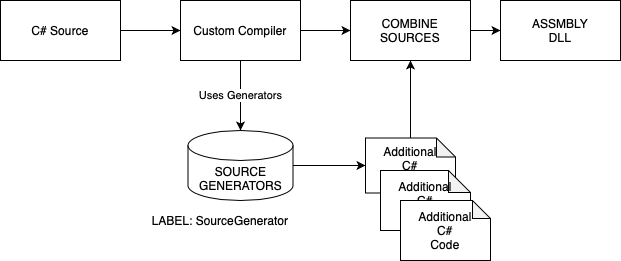

# A BRIEF INTRODUCTION TO NETCODE GEN

## The motivation for moving toward a new worflow
In the previous code-generation system we were relying on Unity Editor compilation hooks to add generated serialization code to the project.
By simplifying the logic, at the end of the compilation for every assembly who were referencing Unity.NetCode and have some types to serialize,
we generated:
- a new derived assembly definition, with suffix .generated
- all the component/rpc/command serializers
- and finally a system responsible to register them at runtime.

While that logic works, is pretty custom, different from every other code generation logic we have in dots elsewhere,
and not without some edge-case problems. More importantly though, is making the compilation time longer and more annoying, especially for large projects, since we are compiling more assemblies now.

As a first step, the new code-generation workflow is aiming to:
* Having something more similar to what Unity.Entities package does. In general, having one way to inject generated code.
* Reduce compilation time, by adding the code directly in the first compilation pass
* Remove assemblies
* Simplify the code-generation logic

Secondarily, we also would like to introduce some further benefits:
* Simplified and safe logic to add/remove custom types to the serialization generation
* An easier to use and safe interface to add/remove ghost variants
* An automatic way to add custom SubType in the project
* A new way to inject serialization for types we don't have direct access to (ex: physics or transform)

## The new logic. Welcome to SourceGenerators:
The proposed solution is going to use the new SourceGenerators, recently added by MS and now used by Entities as a replacement for IL2PP.
The post-processing is still present and used to some extent, but just for one or two specific use cases.

### SourceGenerators (SG for brevity) in a nutshell:
SourceGenerators permit us to analyze the abstract syntax tree, AST (like Roslyn Analyzer), and to **add** to the current compilation new compilation
units (aka C# files).
The use of SG is enabled by importing a new custom compiler, provided by the Unity.Roslyn package. When the package is present,
all dynamic library labeled with "SourceGenerator", present in the project, packages included, are added as "analyzers" to the current compilation.

To create a source generator, it is necessary to implement the ISourceGenerator interface and annotate the class with the [SourceGenerator] attribute, so that
the Roslyn compiler detect and use it.

All generators analyze the code in one/two passes:
* First pass (optional): Parse the syntax tree and retrieve potential candidate struct/class/methods/whatever you need to add code for.
* Second pass (generation): using the potential candidate or looking up specific types directly, you can parse the semantic type mode to retrieve all the usual type information: attributes, type name, interfaces, etc, etc ... and add to the SourceGeneratorContext any valid/invalid C# code.

In the proposed implementation the generation is done in two steps:
1. Analyze the syntax tree, looking up structs and filter the candidates based on the following criteria:
    * **Implement one of the following interfaces:**
        * BufferElement
        * IComponentData
        * IRpcCommandData
        * ICommandData
    * **Has one of these attributes:**
        * GhostComponentVariation
2. Using the candidates found during the syntax analysis step, generate:
    * for each of the component a serializer
    * generate the registration system.

To reduce possible issues and make it certain the generated code works without the need of a anew testsuite, almost all the pure
code-generation and template logic has been reused, by removing any dependencies with Cecil and Reflection, effectively making it independent.
That give us the guarantee that if the extracted type trees are correct we would end up generating the same code as before.

## SOURCE GENERATOR FOR DEVS
The project is organize as follow

    Unity.NetCode
    - Editor
    - Runtime
    -- SourceGenerators      Labels
    --- NetCodeGenerator.dll  *SourceGenerator*
    ---- Source~  (hidden, not handled by Unity)
    ------ NetCodeSourceGenerator
    ------- CodeGenerator
    ------- Generators
    ------- Helpers
    ------ Tests
    ------ SourceGenerators.sln

NetCodeSourceGenerator.dll is a special dll. It contains our implementation of SourceGenerator and is used by the csc compiler.
It **MUST** be not imported by Unity (no plaform, no editor), since it is incompatible (roslyn and some ms dlls) and because some classes and source code are shared in between the netcode and source generators. They would conflicts, causing import error too.
In order to be detected by the ExternalCSharpCompiler (roslyn package) the generators dlls must be labelled with the 'SourceGenerator' label.

There are two way to do that:
- Edit manually the .meta file and add a section like the one below, at the beginning of the file:

    labels:
    - SourceGenerator

- Add the label via the Editor (safer). Because of a limitation (bug) the process is more convoluted:
    - fist move the dll in the Assets folder
    - then add the label here
    - and finally move the dll back the package folder.

The labelling is already done so nothing to worry about.

GeneratorShared.dll contains all the shared code in between netcode and sourcegenerators and must be labelled with 'SourceGenerator' as well, just to make it simpler finding all the types without requiring a dynamic resolution.

#### ========= HOW TO BUILD SOURCE GENERATORS ==============

Source generator DLLs need to be compiled manually outside of the Unity compilation pipeline using the .NET SDK 6.0 or higher:
https://dotnet.microsoft.com/en-us/download/dotnet/6.0
That can be done with dotnet from within the `Packages\com.unity.netcode\Runtime\SourceGenerators\Source~` directory via command prompt:

`dotnet publish -c Release`

Additionally, they can be built/debugged with the `SourceGenerators.sln` solution in the same folder. In order to debug source generators you can replace `Release` with `Debug` when running the publish command.

#### ========= HOW TO UNIT TEST GENERATORS ==============
In addition to the sourcegenerators dlls a Test project has been configured. Is is possible now to unit-test and debug SG logic and code
without the need to run/compile the editor. That make the development iteration faster and also let to analyze specific use cases.

The tests can be run with `dotnet test`, Rider (and probably VS) also discover and and run the tests as expected.

A bunch of unit tests who covers many aspects of the generations are already provided. Please adds other tests in SourceGeneratorTests.cs or add in other files the Test folder.

#### ========= HOW TO DEBUG GENERATORS ==============
Debugging can be a little .. annoying and frustrating ... but it is doable.
First, if you can run the tests on Windows and use VS, do it. The overall experience is a little better. That being said, debugging is also possible with Rider, but
with some caveats.
SourceGenerator are run by the csc process and so you need to attach the debugger on the fly in order to debug the generator at runtime.
NOTE: I found impossible to attach and debug the generator process with Rider since updgrading to build 2020.3. I'm not sure either if it is a combination of Unity 2020.2 and Rider together,
but using Unity 2020.1.2f and Rider 2020.1 I was able to attach and debug the generator.

Some utilities has been provided to let attach to the running process in a controllable manner.

You can use WaitForDebugger function, provided by the SourceGeneratorHelper.cs, who will let the process wait until a debugger is attached. It is possible to
wait for a specific assembly or syntax node by passing the right argument.
On Windows only, use System.Diagnostic.Debugger.Launch to forcibly open an instance of VS (does not work on osx or linux). Note that it will be invoked multiple time
(one for each syntax node) if you put that into the NetCodeSyntaxReceiver.VisitNode method, so use it with some checks around if you don't want to end up
with hundreds of popup on your screen.

Finally, logs are supported and appended to the Temp/NetCodeGenerator.log file. You can log anytime INFO, WARNING, ERROR and EXCEPTIONS.
Error and Exeption are also reported and shown in the Editor (except for the callstack).

##### --- FASTER DEBUGGING ITERATION ON A SINGLE ASSEMBLY ---
If you want to focus on a single assembly, is easier usually to proceed as follow:
-- Grab from the Temp folder the TempUnityFile-XXX file related to the assembly you want to debug
-- Copy the file in temporary directory (ex: sgtests) and rename it to something more convenient, for example compile.out
-- Open the terminal and go to project root folder
-- Invoke manually the compilation with a command like this:
    Library/PackageCache/com.unity.rosyln@0.0.0-preview.8/Compiler~/mac/csc /noconfig @PATH-TO-YOUR-TEMP-FOLDER/compile.out
This will start the compilation and invoke the generator; From here, attach to it as usual.
